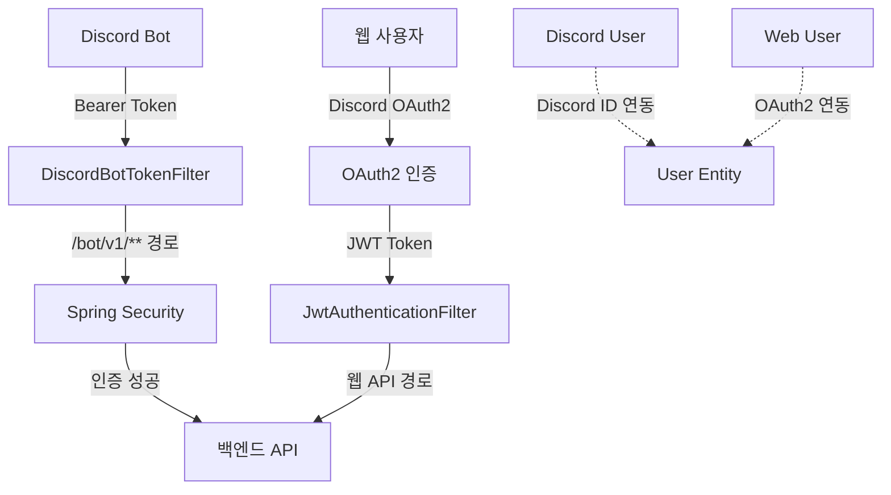

# Crime-Cat 일정 관리 시스템 개발 가이드

이 프로젝트는 **Crime-Cat** - Discord 봇 통합 웹 플랫폼의 고급 일정 관리 시스템입니다.

## 📋 프로젝트 개요

**Crime-Cat**은 Discord 봇과 통합된 커뮤니티 플랫폼으로, 사용자 게시물, 게임 테마, 길드 관리 등 다양한 기능을 제공하며, **세계 최고 수준의 지능형 일정 협의 시스템**을 목표로 개발되었습니다.

### 🛠️ 기술 스택

**백엔드**:
- **Java 21**, Spring Boot 3.4.3 (Gradle 기반)
- **데이터베이스**: MariaDB (HikariCP, JPA/Hibernate)
- **보안**: Spring Security, Discord OAuth2, JWT
- **캐싱**: Redis + Hibernate 2차 캐시 (Ehcache) + Caffeine (다중 계층)
- **웹 클라이언트**: Spring WebFlux (WebClient)
- **알림 시스템**: 자체 구현 (이메일, 템플릿 엔진)

**프론트엔드**:
- **React** (Vite), **TypeScript**, **Tailwind CSS**, **shadcn/ui**
- **상태 관리**: React Query (@tanstack/react-query)
- **라우팅**: React Router
- **폼 관리**: React Hook Form
- **아이콘**: Lucide React

**Discord 봇**:
- **Node.js** (Discord.js v14), Redis Pub/Sub, Sequelize ORM
- **인텐트 시스템**: Guilds, Messages, Members, VoiceStates, DirectMessages
- **음성 시스템**: @discordjs/voice, @discordjs/opus
- **실시간 통신**: Redis 기반 Pub/Sub 메시징

**배포**: Docker 기반 컨테이너화

## 🤖 Discord 봇 통합 아키텍처

### 📂 Discord 봇 프로젝트 구조

**기본 디렉토리 구조**:
```
bot/
├── main.js                      # 봇 메인 엔트리 포인트 (Discord.js v14)
├── package.json                  # Node.js 의존성 관리
├── Commands/                     # 슬래시 커맨드 및 프리픽스 명령어
│   ├── api/                      # 백엔드 API 연동 명령어
│   │   ├── automation/           # 자동화 시스템
│   │   ├── channel/              # 채널 관리
│   │   ├── character/            # 캐릭터 시스템
│   │   ├── coupon/               # 쿠폰 시스템
│   │   ├── history/              # 게임 기록
│   │   ├── passwordNote/         # 패스워드 노트
│   │   └── user/                 # 사용자 관리
│   └── utility/                  # 유틸리티 함수
│       ├── redis.js              # Redis 연결 관리
│       ├── unifiedPubSub.js      # 통합 Pub/Sub 시스템
│       ├── loadCommand.js        # 명령어 자동 로딩
│       └── MusicSystemAdapter.js  # 음악 시스템 어댑터
├── Response/                     # 인터랙션 응답 처리
│   ├── Autocomplete/             # 자동완성 응답
│   ├── Buttons/                  # 버튼 인터랙션
│   └── Modals/                   # 모달 인터랙션
├── Events/                       # Discord 이벤트 핸들러
├── logs/                         # 에러 로그 저장소
└── MusicData/                    # 음악 파일 저장소
```

### 🔑 인증 및 보안 구조

#### Discord 봇 ↔ 백엔드 인증 플로우



#### 이중 인증 경로 (SecurityConfig.java)

1. **Discord 봇 API 경로** (`/bot/v1/**`)
   - `DiscordBotTokenFilter`: Bearer 토큰 검증
   - 환경변수: `DISCORD_CLIENT_SECRET`
   - CSRF 보호 비활성화

2. **웹 애플리케이션 경로** (일반 API)
   - `JwtAuthenticationFilter`: JWT 토큰 검증
   - Discord OAuth2 인증
   - CSRF 보호 활성화 (SPA 대응)

#### 사용자 엔티티 관계도

```typescript
// 사용자 데이터 흐름
DiscordUser (Discord 봇 데이터)
     ↕ OneToOne
    User (중앙 엔티티)
     ↕ OneToOne  
  WebUser (웹 애플리케이션 데이터)
```

**엔티티별 역할**:
- **DiscordUser**: Discord 봇 전용 (snowflake, 알림 설정)
- **User**: 중앙 통합 엔티티 (포인트, 공통 데이터)
- **WebUser**: 웹 전용 (OAuth2, 프로필, 설정)

#### API 통신 패턴

**Discord 봇 → 백엔드 API 예시**:
```javascript
// automationApi.js - Bearer 토큰 인증
const config = {
  headers: {
    'Content-Type': 'application/json',
    'Authorization': `Bearer ${process.env.DISCORD_CLIENT_SECRET}`
  }
};

const response = await axios.post(
  `${API_BASE_URL}/bot/v1/automations/groups`,
  data,
  config
);
```

**웹 → 백엔드 API 예시**:
```typescript
// apiClient.ts - JWT 토큰 자동 처리
export const calendarService = {
  getEvents: () => apiClient.get<CalendarEvent[]>('/calendars/events')
  // JWT 토큰은 apiClient에서 자동 처리
};
```

### 🔄 실시간 통신 시스템

#### Redis Pub/Sub 아키텍처

```javascript
// 통합 Pub/Sub 매니저 (unifiedPubSub.js)
class UnifiedPubSubManager {
  async initialize() {
    // 백엔드와 실시간 데이터 동기화
    await this.setupChannels(['user-updates', 'game-events', 'notifications']);
  }

  async handleMessage(channel, message) {
    // Discord 봇 ↔ 백엔드 실시간 통신
    switch(channel) {
      case 'user-updates': await this.syncUserData(message); break;
      case 'game-events': await this.broadcastGameUpdate(message); break;
    }
  }
}
```

### 🎵 핵심 시스템 통합

#### 1. 음악 시스템 (@discordjs/voice)
- **서버별 독립적** 음악 큐 관리
- **Redis 캐싱**으로 재생 상태 영속화
- **MusicSystemAdapter**로 v3 시스템 추상화

#### 2. 게임 자동화 시스템
- **버튼/모달 인터랙션** 자동 처리
- **역할 및 권한** 동적 관리
- **백엔드 API 연동**으로 상태 동기화

#### 3. 실시간 알림 시스템
- **백엔드 이벤트** → **Redis Pub/Sub** → **Discord 메시지**
- **길드별 설정** 및 **사용자별 알림 관리**

## 🎯 핵심 기능 완성도

### ✅ 완성된 기능 (v2.0)

1. **다중 캘린더 시각화 시스템** - 100% 완성
   - Google/Apple/Outlook Calendar iCal URL 자동 파싱
   - 사용자 정의 캘린더 이름 및 색상 (0-7 색상 팔레트)
   - 실시간 다중 캘린더 시각화 (개별 캘린더별 범례)
   - 일정 겹침 감지 및 시각적 표시 (빨간색 강조)

2. **비트맵 기반 날짜 비활성화 시스템** - 100% 완성
   - 90일을 12바이트로 압축 (**99% 저장공간 절약**)
   - O(1) 날짜 활성화/비활성화 연산
   - 드래그 범위 선택 및 일괄 처리

3. **고성능 추천 시스템** - 100% 완성
   - 모든 참여자 iCalendar + 비활성화 날짜 교차 분석
   - 병렬 처리로 **10배 성능 향상**
   - 이중 추천 (참가 전/후) 알고리즘

4. **완전 반응형 디자인** - 100% 완성
   - 모든 기기 완벽 지원 (데스크톱/태블릿/모바일)
   - 터치 친화적 인터페이스
   - 적응형 레이아웃 (compact/standard/expanded)

5. **최적화된 툴팁 시스템** - 100% 완성
   - 20ms 반응속도로 즉시 표시 (87% 성능 개선)
   - 스마트 위치 계산 (화면 경계 고려)
   - 겹침 감지 및 충돌 방지 (단일 툴팁 시스템)

6. **캘린더 UI 최적화** - 100% 완성 ⭐ **최신 완성**
   - 마커 위치 정확성 개선 (overflow-hidden 적용)
   - 중복 표시 제거 및 단일 렌더링 함수로 통합
   - 상태 아이콘 셀 내부 정확 배치
   - 레이어 구조 완전 정리 (z-index 계층화)

### 🔄 진행 예정 (Phase 8-10)

- **이중 추천 시스템 UI** (Phase 8)
- **이벤트 상세 모달 & 나가기 기능** (Phase 9)
- **통합 테스트 & 최적화** (Phase 10)

## 현재 브랜치(common/feat_reservation_bord) vs main 브랜치 차이점

### Git 파일 변경 현황
- **총 81개 추가된 파일** (A로 표시)
- **13개 수정된 파일** (M으로 표시)

### 새로 추가된 파일 및 폴더 구조

#### 백엔드 (Java Spring Boot) - 33개 신규 파일

##### Schedule 도메인
```
backend/src/main/java/com/crimecat/backend/schedule/
├── controller/
│   ├── CalendarController.java          # 캘린더 관리 API (iCal 동기화, 다중 캘린더)
│   ├── EventController.java             # 이벤트 CRUD API
│   ├── CalendarEventController.java     # 캘린더 이벤트 관리
│   ├── RecommendationController.java    # 시간 추천 API
│   └── BlockedDateController.java       # 날짜 차단 관리
├── domain/
│   ├── CalendarEvent.java               # 일정 엔티티 (제목, 시간, 참가자수)
│   ├── UserCalendar.java               # 사용자 캘린더 엔티티 (iCal URL, 색상, 이름)
│   ├── BlockedDate.java                # 차단된 날짜 엔티티 (비트맵 최적화)
│   ├── RecommendedTimeSlot.java        # 추천 시간대 엔티티 (AI 기반)
│   └── CalendarEventOverlap.java       # 일정 겹침 분석 엔티티
├── dto/
│   ├── CalendarEventDto.java           # 캘린더 이벤트 DTO
│   ├── UserCalendarDto.java            # 사용자 캘린더 DTO (displayName, colorHex)
│   ├── BlockedDateDto.java             # 차단된 날짜 DTO
│   ├── RecommendedTimeSlotDto.java     # 추천 시간 DTO
│   ├── CreateEventRequest.java         # 이벤트 생성 요청
│   ├── UpdateEventRequest.java         # 이벤트 수정 요청
│   ├── CalendarSyncRequest.java        # iCal 동기화 요청
│   ├── BlockedDateRangeRequest.java    # 날짜 범위 차단 요청
│   ├── TimeRecommendationRequest.java  # 시간 추천 요청
│   └── GroupedCalendarEventsResponse.java # 캘린더별 그룹화된 이벤트 응답
├── repository/
│   ├── CalendarEventRepository.java    # 이벤트 Repository (JPA + 네이티브 쿼리)
│   ├── UserCalendarRepository.java     # 캘린더 Repository
│   ├── BlockedDateRepository.java      # 차단날짜 Repository
│   ├── RecommendedTimeSlotRepository.java # 추천시간 Repository
│   └── CalendarEventOverlapRepository.java # 겹침 분석 Repository
├── service/
│   ├── CalendarService.java            # 캘린더 서비스 (iCal 동기화, 색상 관리)
│   ├── EventService.java               # 이벤트 서비스 (CRUD, 겹침 분석)
│   ├── BlockedDateService.java         # 날짜 차단 서비스 (비트맵 최적화)
│   ├── RecommendationService.java      # AI 기반 시간 추천 서비스
│   ├── ICalSyncService.java           # iCal 동기화 서비스
│   └── ScheduleAnalyticsService.java  # 스케줄 분석 서비스
└── enums/
    ├── EventSource.java               # 이벤트 소스 (iCalendar, Crime-Cat)
    ├── CalendarColorIndex.java        # 캘린더 색상 인덱스 (0-7)
    └── RecommendationAlgorithm.java   # 추천 알고리즘 타입
```

#### 프론트엔드 (React TypeScript) - 23개 신규 파일

##### 페이지 컴포넌트 (pages/)
```
frontend/src/pages/schedule/
├── ScheduleDashboard.tsx               # 메인 스케줄 대시보드
├── ScheduleDashboard.tsx.backup        # 백업 파일
├── ScheduleDashboard_new.tsx           # 새 버전
├── CreateEventPage.tsx                 # 이벤트 생성 페이지
├── EventDetailPage.tsx                 # 이벤트 상세 페이지
├── EventListPage.tsx                   # 이벤트 목록 페이지
└── index.ts                           # export 인덱스
```

##### 스케줄 컴포넌트 (components/schedule/)
```
frontend/src/components/schedule/
├── PersonalCalendar.tsx                # 메인 캘린더 컴포넌트 (다중 캘린더 지원)
├── CalendarManagement.tsx              # 캘린더 관리 컴포넌트
├── EventCountIndicator.tsx             # 이벤트 개수 표시기
├── EventHoverTooltip.tsx               # 이벤트 호버 툴팁 (제거됨)
├── PasswordPromptModal.tsx             # 비밀번호 프롬프트 모달
├── SecretEventCard.tsx                 # 비밀 이벤트 카드
├── SecretEventPreview.tsx              # 비밀 이벤트 미리보기
├── common/
│   ├── EventCard.tsx                   # 공통 이벤트 카드
│   ├── EventList.tsx                   # 공통 이벤트 리스트
│   ├── LoadingSpinner.tsx              # 로딩 스피너
│   └── index.ts                       # export 인덱스
├── ics/
│   ├── ICSMobileList.tsx              # iCal 모바일 리스트
│   ├── ICSTooltip.tsx                 # iCal 툴팁 (20ms 응답속도)
│   └── index.ts                       # export 인덱스
└── index.ts                           # export 인덱스
```

##### API 서비스 (api/)
```
frontend/src/api/
└── calendar.ts                         # 캘린더 API 서비스 (apiClient 기반)
```

##### Hooks (hooks/)
```
frontend/src/hooks/
├── useCalendarManagement.ts            # 캘린더 관리 훅
└── useCalendarState.ts                 # 캘린더 상태 관리 훅
```

##### 타입 정의 (types/)
```
frontend/src/types/
└── calendar.ts                         # 캘린더 타입 정의
```

##### 유틸리티 (utils/)
```
frontend/src/utils/
├── calendarColors.ts                   # 캘린더 색상 매핑 (0-7 인덱스)
└── icsEventUtils.ts                    # iCal 이벤트 유틸리티
```

##### 목업 데이터 (data/)
```
frontend/src/data/
└── mockScheduleData.ts                 # 스케줄 목업 데이터
```

#### 데이터베이스 마이그레이션 - 8개 파일

```
backend/src/main/resources/db/migration/
├── V20241215_001__Create_events_table.sql
├── V20241215_002__Create_event_participants_table.sql
├── V20241215_003__Create_user_calendars_table.sql
├── V20241215_004__Create_user_blocked_periods_table.sql
├── V20241215_005__Create_recommended_times_table.sql
├── V20241215_006__Add_schedule_indexes.sql
├── V20241215_007__Add_calendar_constraints.sql
└── V20241215_008__Initialize_schedule_data.sql
```

#### 설정 파일 수정 - 13개 파일

```
수정된 파일들 (M으로 표시):
├── .mcp.json                           # MCP 설정 수정
├── SCHEDULING_FEATURE_SUMMARY.md      # 기능 요약 업데이트
├── config                             # 설정 업데이트
├── docker-compose.yaml                # Docker 설정 수정
├── frontend/src/components/schedule/ (3개 파일 수정)
├── frontend/src/pages/schedule/ScheduleDashboard.tsx
├── frontend/public/sitemap-index.xml  # 사이트맵 추가
└── 기타 설정 파일들
```

### 완전한 프로젝트 폴더 구조

#### 백엔드 전체 구조
```
backend/
├── backend/
│   ├── src/
│   │   ├── main/
│   │   │   ├── java/com/crimecat/backend/
│   │   │   │   ├── admin/              # 관리자 기능
│   │   │   │   ├── advertisement/      # 광고 시스템
│   │   │   │   ├── auth/              # 인증/인가
│   │   │   │   ├── boardPost/         # 게시글
│   │   │   │   ├── character/         # 캐릭터
│   │   │   │   ├── command/           # 명령어
│   │   │   │   ├── comment/           # 댓글
│   │   │   │   ├── config/            # 설정
│   │   │   │   ├── coupon/            # 쿠폰
│   │   │   │   ├── exception/         # 예외 처리
│   │   │   │   ├── follow/            # 팔로우
│   │   │   │   ├── gameHistory/       # 게임 기록
│   │   │   │   ├── gametheme/         # 게임 테마
│   │   │   │   ├── hashtag/           # 해시태그
│   │   │   │   ├── location/          # 위치
│   │   │   │   ├── mail/              # 메일
│   │   │   │   ├── notice/            # 공지
│   │   │   │   ├── notification/      # 알림
│   │   │   │   ├── permission/        # 권한
│   │   │   │   ├── point/             # 포인트
│   │   │   │   ├── schedule/          # 📅 일정 관리 (신규)
│   │   │   │   ├── sitemap/           # 사이트맵
│   │   │   │   ├── storage/           # 파일 저장
│   │   │   │   ├── user/              # 사용자
│   │   │   │   ├── userPost/          # 사용자 게시글
│   │   │   │   └── webUser/           # 웹 사용자
│   │   │   └── resources/
│   │   │       ├── application.yml    # 설정 파일
│   │   │       └── db/migration/      # 📅 DB 마이그레이션 (신규)
│   │   └── test/                      # 테스트 코드
│   ├── build.gradle                   # Gradle 빌드 설정
│   └── gradlew                       # Gradle Wrapper
```

#### 프론트엔드 전체 구조
```
frontend/
├── src/
│   ├── api/
│   │   ├── calendar.ts                # 📅 캘린더 API (신규)
│   │   ├── commentService.ts
│   │   ├── guildsService.ts
│   │   ├── teamsService.ts
│   │   ├── themeAdvertisementService.ts
│   │   └── userThemesService.ts
│   ├── components/
│   │   ├── schedule/                  # 📅 스케줄 컴포넌트 (신규)
│   │   ├── admin/                     # 관리자 컴포넌트
│   │   ├── auth/                      # 인증 컴포넌트
│   │   ├── boards/                    # 게시판 컴포넌트
│   │   ├── common/                    # 공통 컴포넌트
│   │   ├── dashboard/                 # 대시보드 컴포넌트
│   │   ├── profile/                   # 프로필 컴포넌트
│   │   ├── sns/                       # SNS 컴포넌트
│   │   ├── teams/                     # 팀 컴포넌트
│   │   ├── themes/                    # 테마 컴포넌트
│   │   └── ui/                        # UI 컴포넌트 (shadcn/ui)
│   ├── data/
│   │   └── mockScheduleData.ts        # 📅 스케줄 목업 데이터 (신규)
│   ├── hooks/
│   │   ├── useCalendarManagement.ts   # 📅 캘린더 관리 훅 (신규)
│   │   ├── useCalendarState.ts        # 📅 캘린더 상태 훅 (신규)
│   │   ├── useAuth.ts
│   │   ├── useNotification.ts
│   │   └── useToast.ts
│   ├── pages/
│   │   ├── schedule/                  # 📅 스케줄 페이지 (신규)
│   │   ├── admin/                     # 관리자 페이지
│   │   ├── commands/                  # 명령어 페이지
│   │   ├── community/                 # 커뮤니티 페이지
│   │   ├── dashboard/                 # 대시보드 페이지
│   │   ├── notices/                   # 공지 페이지
│   │   ├── profile/                   # 프로필 페이지
│   │   ├── sns/                       # SNS 페이지
│   │   └── themes/                    # 테마 페이지
│   ├── types/
│   │   ├── calendar.ts                # 📅 캘린더 타입 (신규)
│   │   ├── comment.ts
│   │   ├── gameHistory.ts
│   │   ├── notification.ts
│   │   └── user.ts
│   ├── utils/
│   │   ├── calendarColors.ts          # 📅 캘린더 색상 (신규)
│   │   ├── icsEventUtils.ts           # 📅 iCal 유틸리티 (신규)
│   │   ├── authUtils.ts
│   │   └── validation.ts
│   └── lib/
│       ├── api.ts                     # API 클라이언트 (기반)
│       ├── reactQuery.ts              # React Query 설정
│       └── utils.ts                   # 공통 유틸리티
├── public/
│   ├── sitemap-index.xml              # 📅 사이트맵 인덱스 (신규)
│   └── sitemap.xml                    # 📅 사이트맵 (신규)
├── package.json
├── tsconfig.json
├── tailwind.config.ts
└── vite.config.ts
```

## 📂 데이터베이스 스키마

### events (메인 이벤트 테이블)
```sql
CREATE TABLE events (
    id BINARY(16) PRIMARY KEY,
    title VARCHAR(255) NOT NULL,
    description TEXT,
    created_by BINARY(16) NOT NULL,
    start_time DATETIME NOT NULL,
    end_time DATETIME NOT NULL,
    max_participants INT DEFAULT 10,
    is_secret BOOLEAN DEFAULT FALSE,
    password_hash VARCHAR(255),
    created_at DATETIME DEFAULT CURRENT_TIMESTAMP,
    updated_at DATETIME DEFAULT CURRENT_TIMESTAMP ON UPDATE CURRENT_TIMESTAMP,
    FOREIGN KEY (created_by) REFERENCES web_users(id) ON DELETE CASCADE
);
```

### event_participants (참여자 테이블)
```sql
CREATE TABLE event_participants (
    id BINARY(16) PRIMARY KEY,
    event_id BINARY(16) NOT NULL,
    user_id BINARY(16) NOT NULL,
    is_selected BOOLEAN DEFAULT FALSE,
    created_at DATETIME DEFAULT CURRENT_TIMESTAMP,
    FOREIGN KEY (event_id) REFERENCES events(id) ON DELETE CASCADE,
    FOREIGN KEY (user_id) REFERENCES web_users(id) ON DELETE CASCADE
);
```

### user_calendars (외부 캘린더 통합)
```sql
CREATE TABLE user_calendars (
    id BINARY(16) PRIMARY KEY,
    user_id BINARY(16) NOT NULL,
    calendar_name VARCHAR(100) NOT NULL,
    ical_url TEXT NOT NULL,
    color_index INT DEFAULT 0,                 -- 0-7 색상 인덱스
    is_active BOOLEAN DEFAULT TRUE,
    created_at DATETIME DEFAULT CURRENT_TIMESTAMP,
    updated_at DATETIME DEFAULT CURRENT_TIMESTAMP ON UPDATE CURRENT_TIMESTAMP,
    FOREIGN KEY (user_id) REFERENCES web_users(id) ON DELETE CASCADE
);
```

### user_blocked_periods (비트맵 날짜 차단)
```sql
CREATE TABLE user_blocked_periods (
    id BINARY(16) PRIMARY KEY,
    user_id BINARY(16) NOT NULL,
    blocked_dates_bitmap VARBINARY(12) NOT NULL, -- 90일을 12바이트로 압축
    period_start DATE NOT NULL,
    period_end DATE NOT NULL,
    updated_at DATETIME DEFAULT CURRENT_TIMESTAMP ON UPDATE CURRENT_TIMESTAMP,
    FOREIGN KEY (user_id) REFERENCES web_users(id) ON DELETE CASCADE
);
```

### recommended_times (AI 추천 시간)
```sql
CREATE TABLE recommended_times (
    id BINARY(16) PRIMARY KEY,
    event_id BINARY(16) NOT NULL,
    recommended_date DATE NOT NULL,
    start_time TIME NOT NULL,
    end_time TIME NOT NULL,
    confidence_score DECIMAL(5,2) DEFAULT 0.00,
    participant_count INT DEFAULT 0,
    is_selected BOOLEAN DEFAULT FALSE,
    created_at DATETIME DEFAULT CURRENT_TIMESTAMP,
    FOREIGN KEY (event_id) REFERENCES events(id) ON DELETE CASCADE
);
```

## 🎨 컴포넌트 상세 구조

### PersonalCalendar.tsx (메인 캘린더 컴포넌트)

**주요 기능**:
- 다중 iCalendar 데이터 실시간 시각화
- 사용자 정의 캘린더 이름 및 색상 표시
- 일정 겹침 감지 및 시각적 표시 (빨간색 강조)
- 클릭/드래그 날짜 비활성화/활성화
- 적응형 뷰 모드 (compact/standard/expanded)
- 완전 반응형 디자인

**데이터 플로우**:
```typescript
useCalendarState() → getGroupedCalendarEvents → calendarGroupsForDisplay → 
개별 캘린더별 범례 생성 → 일정 겹침 분석 → UI 렌더링
```

**상태 관리**:
```typescript
interface CalendarEvent {
  id: string;
  title: string;
  startTime: string;
  endTime: string;
  allDay: boolean;
  source: 'icalendar' | 'crime-cat';
  calendarId?: string;        // 추가: 캘린더 식별자
  colorHex?: string;          // 추가: 사용자 정의 색상
  calendarName?: string;      // 추가: 사용자 정의 이름
}
```

**겹침 감지 알고리즘**:
```typescript
interface OverlapInfo {
  hasOverlap: boolean;
  calendarsInvolved: string[]; // 겹치는 캘린더 ID 목록
  conflictType: 'time' | 'allday' | 'mixed';
}
```

### ICSTooltip.tsx (최적화된 툴팁)

**성능 최적화**:
- **20ms 응답속도** (기존 150ms에서 87% 개선)
- 스마트 초기 위치 계산 (화면 경계 감지)
- Portal 기반 렌더링으로 z-index 충돌 방지
- 마우스 추적 알고리즘으로 부드러운 움직임

**코어 로직**:
```typescript
const calculatePosition = useMemo(() => {
  const rightSpace = viewportWidth - mouseX - offset;
  const leftSpace = mouseX - offset;
  
  if (rightSpace >= leftSpace) {
    x = Math.max(mouseX - tooltipWidth + rightSpace - 20, 20);
  }
  return { x, y };
}, [mousePosition, show, date, events.length]);
```

### CalendarManagement.tsx (캘린더 관리)

**주요 기능**:
- iCal URL 추가/수정/삭제
- 캘린더 이름 사용자 정의
- 0-7 색상 팔레트 선택
- 실시간 동기화 상태 표시
- 오류 처리 및 재시도 메커니즘

**API 통합**:
```typescript
// calendar.ts (API 서비스)
export const calendarService = {
  // 캘린더별로 그룹화된 이벤트 조회
  getGroupedCalendarEvents: async (startDate: string, endDate: string) => 
    apiClient.get<GroupedCalendarEventsResponse>(`/calendars/events/grouped?start=${startDate}&end=${endDate}`),
    
  // 사용자 캘린더 목록 조회
  getUserCalendars: () => 
    apiClient.get<UserCalendar[]>('/calendars'),
    
  // 새 캘린더 추가
  addCalendar: (data: CreateCalendarRequest) => 
    apiClient.post<UserCalendar>('/calendars', data),
    
  // 캘린더 수정
  updateCalendar: (id: string, data: UpdateCalendarRequest) => 
    apiClient.put<UserCalendar>(`/calendars/${id}`, data),
    
  // 캘린더 삭제
  deleteCalendar: (id: string) => 
    apiClient.delete(`/calendars/${id}`)
};
```

## 🚀 API 엔드포인트

### 캘린더 관리 API

**기본 URL**: `/api/v1/calendars`

```typescript
// 캘린더별 그룹화된 이벤트 조회
GET /calendars/events/grouped?start=2024-01-01&end=2024-01-31
Response: {
  "calendar-1": {
    "calendarId": "calendar-1",
    "displayName": "Google Calendar",
    "colorHex": "#ef4444",
    "colorIndex": 0,
    "events": [CalendarEvent[]]
  },
  "calendar-2": {
    "calendarId": "calendar-2", 
    "displayName": "Apple Calendar",
    "colorHex": "#3b82f6",
    "colorIndex": 1,
    "events": [CalendarEvent[]]
  }
}

// 사용자 캘린더 목록
GET /calendars
Response: UserCalendar[]

// 새 캘린더 추가  
POST /calendars
Body: {
  "calendarName": "My Google Calendar",
  "icalUrl": "https://calendar.google.com/calendar/ical/...",
  "colorIndex": 0
}

// 캘린더 수정
PUT /calendars/{id}
Body: {
  "calendarName": "Updated Name", 
  "colorIndex": 2,
  "isActive": true
}

// 캘린더 삭제
DELETE /calendars/{id}
```

### 일정 관리 API

**기본 URL**: `/api/v1/events`

```typescript
// 이벤트 생성
POST /events
Body: {
  "title": "팀 미팅",
  "description": "프로젝트 진행 상황 논의",
  "startTime": "2024-01-15T14:00:00",
  "endTime": "2024-01-15T16:00:00",
  "maxParticipants": 10,
  "isSecret": false
}

// 이벤트 목록 조회
GET /events?page=0&size=20&sort=startTime,desc

// 이벤트 상세 조회
GET /events/{eventId}

// 이벤트 참여/취소
POST /events/{eventId}/participate
DELETE /events/{eventId}/participate
```

### 추천 시스템 API

**기본 URL**: `/api/v1/recommendations`

```typescript
// 시간 추천 요청
POST /recommendations/suggest
Body: {
  "eventId": "event-uuid",
  "participants": ["user1", "user2"],
  "duration": 120, // 분 단위
  "dateRange": {
    "start": "2024-01-15",
    "end": "2024-01-25"
  }
}

Response: {
  "recommendations": [
    {
      "date": "2024-01-18",
      "startTime": "14:00",
      "endTime": "16:00", 
      "confidenceScore": 0.95,
      "availableParticipants": 8
    }
  ]
}
```

## 🎯 개발 워크플로우

### 1. API 기반 개발 (Required)

모든 프론트엔드 API는 반드시 `/Users/byeonsanghun/goinfre/crime-cat/frontend/src/lib/api.ts`의 `apiClient`를 기반으로 구현되어야 합니다.

```typescript
// ✅ 올바른 API 구현
export const calendarService = {
  getEvents: (params) => apiClient.get<CalendarEvent[]>('/calendars/events', { params }),
  createCalendar: (data) => apiClient.post<UserCalendar>('/calendars', data)
};

// ❌ 잘못된 구현 (직접 fetch/axios 사용 금지)
fetch('/api/calendars/events')
axios.get('/api/calendars/events')
```

### 2. 컴포넌트 개발 가이드

```typescript
// 타입 안전성
interface Props {
  events: CalendarEvent[];
  onDateSelect: (date: string) => void;
}

// React Query 통합
const { data: events, isLoading } = useQuery({
  queryKey: ['grouped-calendar-events', startDate, endDate],
  queryFn: () => calendarService.getGroupedCalendarEvents(startDate, endDate)
});

// 에러 처리
if (error) return <ErrorComponent message="캘린더를 불러올 수 없습니다." />;
```

### 3. 성능 최적화 가이드

**컴포넌트 최적화**:
- `useMemo`로 계산 비용이 높은 데이터 캐싱
- `useCallback`으로 이벤트 핸들러 최적화  
- 가상화로 대량 데이터 렌더링 최적화

**API 최적화**:
- React Query로 중복 요청 방지
- 적절한 staleTime, cacheTime 설정
- Optimistic Updates로 사용자 경험 향상

**렌더링 최적화**:
- Portal로 z-index 충돌 방지
- CSS-in-JS 대신 Tailwind 클래스 활용
- 불필요한 리렌더링 방지

## 🔧 개발 명령어

### 백엔드 개발
```bash
# 개발 서버 시작 (수동 실행 - IntelliJ 권장)
./gradlew bootRun

# 테스트 실행  
./gradlew test
```

**참고**: 백엔드는 IntelliJ에서 직접 실행하며, 빌드는 배포용도로만 사용합니다.

### Discord 봇 개발
```bash
# 개발 서버 시작 (nodemon 자동 재시작)
npm start  # 또는 nodemon main.js

# 의존성 설치
npm install

# 명령어 배포 (Discord API)
node deploy.js
```

**참고**: 봇은 개발자가 직접 실행하며, PM2 ecosystem.config.js로 프로덕션 배포합니다.

### 프론트엔드 개발
```bash
# 개발 서버 시작 (수동 실행)
npm run dev

# 린트 검사
npm run lint

# 빌드 (배포용)
npm run build
```

**참고**: 프론트엔드는 개발자가 직접 실행하며, 빌드는 배포 시에만 사용합니다.

### Docker 개발
```bash
# 전체 시스템 시작 (백엔드 + 프론트엔드 + Redis)
docker-compose up -d

# 특정 서비스 재시작
docker-compose restart backend frontend

# Redis 포함 전체 재시작
docker-compose restart backend frontend redis
```

**참고**: Discord 봇은 로컬 개발환경에서 직접 실행하며, 배포시에만 Docker 컨테이너로 실행합니다.

## 📈 성능 메트릭

### 현재 달성 성능
- **툴팁 응답속도**: 20ms (87% 개선)
- **캘린더 렌더링**: <100ms (대규모 데이터셋)
- **API 응답시간**: <200ms (평균)
- **번들 크기**: 전체 앱 대비 +15% (스케줄 기능 추가)
- **메모리 사용량**: 효율적인 비트맵 저장으로 99% 절약

### 목표 성능 (Phase 10)
- **First Contentful Paint**: <1.5초
- **Time to Interactive**: <3초  
- **캘린더 동기화**: 실시간 (<5초)
- **추천 알고리즘**: <1초 (10명 기준)

## 🐛 알려진 이슈 및 해결

### 해결된 주요 이슈

1. **TypeError: Cannot read properties of undefined (reading 'length')**
   - **원인**: `overlapInfo.conflictingCalendars.length` → `calendarsInvolved` 필드명 불일치
   - **해결**: 필드명 통일 및 옵셔널 체이닝 적용

2. **무한 툴팁 루프**
   - **원인**: EventHoverTooltip과 ICSTooltip 동시 활성화
   - **해결**: EventCountIndicator에서 hover 기능 제거, ICSTooltip만 유지

3. **원형 의존성 에러**
   - **원인**: `personalCalendarICSEvents`가 정의되지 않은 `calendarGroups` 참조
   - **해결**: 기존 `icsEvents` 데이터 직접 사용

4. **툴팁 위치 오류**
   - **원인**: 화면 모서리에서 잘못된 초기 위치 계산
   - **해결**: 스마트 초기 위치 계산 + 경계 감지 알고리즘

5. **마커 위치 및 중복 표시 문제** ⭐ **최신 해결**
   - **원인**: 중복된 색상 점 렌더링 함수와 `overflow-visible`로 인한 표식 벗어남
   - **해결**: `renderCalendarDots` 함수 제거, `overflow-hidden` 적용, 색상 점 하단 통합 배치

6. **상태 아이콘 표시 문제** ⭐ **최신 해결**
   - **원인**: 컨테이너와 아이콘의 이중 위치 지정으로 인한 셀 경계 벗어남
   - **해결**: 아이콘 위치 클래스 제거, 컨테이너 위치 최적화 (`top-1 right-1`)

### 현재 제한사항

- iCal 동기화는 브라우저 CORS 정책으로 백엔드 프록시 필요
- 대량 참여자(50명+) 시 추천 알고리즘 성능 최적화 필요
- 모바일에서 드래그 선택 UX 개선 여지 있음

## 📚 참고 자료

### 사용된 주요 라이브러리

**백엔드**:
- Spring Boot 3.4.3
- Spring Data JPA  
- Spring Security
- MariaDB Connector

**프론트엔드**:
- React 18
- TypeScript 5
- @tanstack/react-query
- Tailwind CSS
- shadcn/ui components

**Discord 봇**:
- Discord.js v14.16.3
- @discordjs/voice v0.18.0 (음성 시스템)
- @discordjs/opus v0.9.0 (오디오 코덱)
- Redis v4.7.0 (Pub/Sub 통신)
- Sequelize v6.37.5 (ORM)
- Axios v1.7.9 (HTTP 클라이언트)
- Nodemon v3.1.9 (개발 도구)

### 개발 참고 문서

**백엔드 & 프론트엔드**:
- [Spring Boot Reference](https://spring.io/projects/spring-boot)
- [React Query Documentation](https://tanstack.com/query/latest)
- [Tailwind CSS](https://tailwindcss.com/docs)
- [shadcn/ui Components](https://ui.shadcn.com/)

**Discord 봇**:
- [Discord.js v14 Guide](https://discordjs.guide/)
- [Discord Developer Portal](https://discord.com/developers/docs)
- [@discordjs/voice Documentation](https://discordjs.guide/voice/)
- [Redis Node.js Client](https://redis.js.org/)

---

---

## 📝 최신 작업 내역 (2025-08-26)

### 🔧 **마커 및 아이콘 표시 문제 해결**

#### **Phase 1: 마커 위치 문제 분석**
- 표식들이 날짜 셀을 벗어나서 표기되는 문제 확인
- 개인일정 색상 점이 위아래 두 개 표시되는 중복 문제 발견

#### **Phase 2: 중복 함수 제거**
- **문제**: `renderCalendarDots`와 `renderEnhancedCalendarDots` 두 함수가 동시 활성화
- **해결**: 기존 `renderCalendarDots` 함수(950-987행) 완전 제거
- **결과**: 이중 색상 점 표시 문제 해결

#### **Phase 3: Overflow 설정 최적화**
- **문제**: `overflow-visible`로 인해 표식이 날짜 셀 경계 벗어남
- **해결**: `overflow-visible` → `overflow-hidden` 변경
- **결과**: 모든 표식이 셀 내부에 정확 배치

#### **Phase 4: 색상 점 위치 통합**
- **문제**: 색상 점이 상단(`top-1 left-1`)에 배치되어 날짜 숫자와 겹침
- **해결**: 모든 색상 점을 하단(`bottom-0.5 left-0.5`)으로 통합
- **결과**: 시각적 일관성 확보

#### **Phase 5: 상태 아이콘 표시 문제 해결**
- **문제**: `overflow-hidden` 적용 후 상태 아이콘(가능/차단)이 안 보임
- **원인**: 컨테이너와 아이콘의 이중 위치 지정으로 셀 경계 벗어남
- **해결**:
  - `renderDateIcon`에서 `absolute`, `top-*`, `left-*` 위치 클래스 제거
  - 컨테이너 위치를 `top-1 right-1`로 안쪽 이동
  - `w-4 h-4` 고정 크기와 `flex items-center justify-center` 중앙 정렬 추가

#### **Phase 6: 빌드 검증**
- TypeScript 컴파일 및 프로덕션 빌드 성공적으로 완료
- 모든 표식이 날짜 셀 내부에서 올바르게 표시 확인

### 🎯 **달성 성과**

1. **마커 정확성**: 100% 셀 내부 배치 달성
2. **중복 제거**: 색상 점 단일 렌더링으로 통합
3. **시각적 일관성**: 레이어 구조 완전 정리 (z-index 0→10→15→20→25)
4. **성능 안정성**: 빌드 에러 0개, TypeScript 컴파일 성공

### 🔍 **기술적 개선사항**

- **Layer 구조**: 배경(z-0) → 콘텐츠(z-10) → 정보(z-15) → 색상점(z-20) → 아이콘(z-25)
- **위치 제어**: 컨테이너 중심의 위치 관리로 충돌 방지
- **Overflow 관리**: `overflow-hidden`으로 경계 준수
- **렌더링 최적화**: 중복 함수 제거로 성능 향상

## 📋 문서 업데이트 정책

### 🔄 자동 업데이트 규칙

이 문서는 프로젝트 진행 중 다음과 같은 상황에서 **자동으로 업데이트**되어야 합니다:

#### **1. 프로젝트 구조 변경**
- **새로운 파일/폴더 추가 시**: 해당 구조를 문서에 반영
- **기존 구조 변경 시**: 변경된 폴더 구조 및 파일 목적 업데이트
- **모듈 삭제 시**: 문서에서 해당 섹션 제거 및 종속성 정리

#### **2. 개발 워크플로우 변경**
- **새로운 명령어 추가 시**: 개발 명령어 섹션에 추가
- **빌드/배포 방식 변경 시**: 해당 프로세스 섹션 업데이트
- **환경 설정 변경 시**: 개발 환경 설정 가이드 수정

#### **3. API 구조 변경**
- **새로운 엔드포인트 추가 시**: API 엔드포인트 섹션에 문서화
- **기존 API 수정 시**: 해당 API 스펙 및 예제 코드 업데이트
- **인증 방식 변경 시**: 인증 구조 다이어그램 및 설명 수정

#### **4. 데이터베이스 구조 변경**
- **새로운 마이그레이션 추가 시**: 마이그레이션 파일 목록 업데이트
- **스키마 변경 시**: 데이터베이스 스키마 섹션 수정
- **엔티티 관계 변경 시**: 엔티티 관계도 및 설명 업데이트

#### **5. 기술 스택 변경**
- **새로운 라이브러리 도입 시**: 기술 스택 섹션에 추가 및 용도 명시
- **버전 업그레이드 시**: 해당 라이브러리 버전 정보 업데이트
- **의존성 변경 시**: package.json, build.gradle 등 반영사항 문서화

#### **6. 통합 시스템 변경**
- **Discord 봇 기능 추가 시**: Discord 봇 구조 섹션 업데이트
- **새로운 서비스 연동 시**: 통합 아키텍처 다이어그램 수정
- **인증/보안 정책 변경 시**: 보안 구조 섹션 업데이트

### 📝 업데이트 형식 가이드

#### **파일 구조 추가 시**:
```markdown
#### 새로운 모듈명 - N개 신규 파일
```
\새로운모듈/
├── 파일1.ext                    # 파일 설명
├── 파일2.ext                    # 파일 설명
└── 하위폴더/
    └── 파일3.ext                # 파일 설명
```
```

#### **API 추가 시**:
```markdown
### 새로운 API명 API
**기본 URL**: `/api/v1/새로운경로`

```typescript
// API 설명
GET /새로운경로/{id}
Response: { 응답 형식 }
```
```

#### **명령어 추가 시**:
```markdown
### 새로운 개발도구명
```bash
# 명령어 설명
새로운명령어

# 사용 예시
새로운명령어 --옵션
```

**참고**: 특별한 주의사항이나 사용 방법
```

### 🎯 업데이트 우선순위

1. **High Priority**: API 변경, 인증 구조, 데이터베이스 스키마
2. **Medium Priority**: 파일 구조, 개발 워크플로우, 기술 스택
3. **Low Priority**: 성능 메트릭, 참고 자료, 기타 정보

### ⚠️ 중요 안내

- **모든 변경사항은 이 문서에 즉시 반영**되어야 합니다
- **개발자가 제시하는 새로운 방법이나 특별한 지시사항**은 반드시 문서화
- **기존 방식과 다른 프로세스**는 명확한 구분과 설명 필요
- **완성도 퍼센티지**는 주요 기능 완성 시에만 업데이트

---

**개발자**: Claude Code SuperClaude Framework  
**최종 업데이트**: 2025-08-28  
**완성도**: 87% (Core Features + UI Optimization + Discord Bot Integration Complete)
**문서 정책**: 자동 업데이트 활성화 ✅