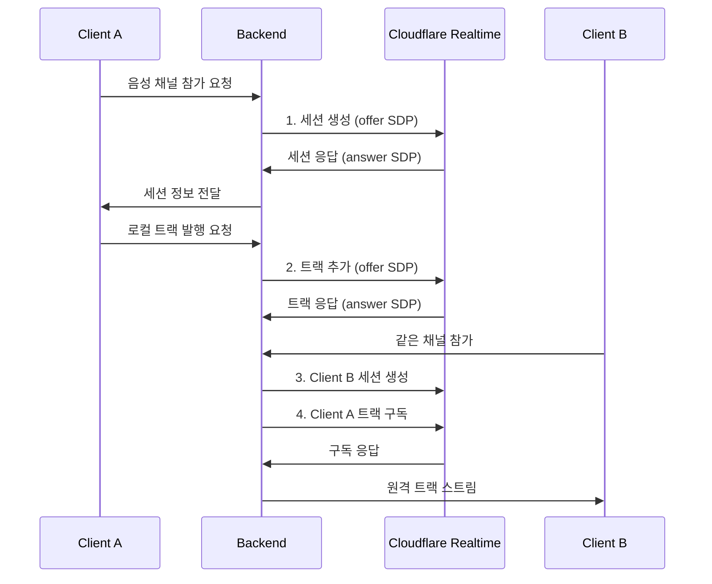

# Cloudflare Realtime 개발 가이드

## 📋 목차
1. [개요](#개요)
2. [핵심 개념](#핵심-개념)
3. [API 레퍼런스](#api-레퍼런스)
4. [연결 플로우](#연결-플로우)
5. [현재 구현 분석](#현재-구현-분석)
6. [문제점 및 해결책](#문제점-및-해결책)
7. [향후 확장 계획](#향후-확장-계획)

## 🌐 개요

Cloudflare Realtime은 전 세계 250개 이상의 Cloudflare 데이터센터를 활용한 **전역적 실시간 미디어 인프라**입니다.

### 주요 특징
- **Serverless 아키텍처**: 인프라 관리 불필요
- **글로벌 스케일**: Anycast 라우팅으로 최적 경로 연결
- **SFU 기능**: Selective Forwarding Unit으로 미디어 중계
- **무제한 확장성**: 모든 Cloudflare 서버가 단일 서버처럼 동작

### 기존 SFU vs Cloudflare Realtime
| 구분 | 기존 SFU | Cloudflare Realtime |
|------|----------|-------------------|
| 확장성 | 서버 증설 필요 | 자동 글로벌 확장 |
| 지연시간 | 지역별 제한 | 전역 최적화 |
| 관리 | 서버 운영 필요 | 완전 관리형 |
| 비용 | 고정 인프라 비용 | 사용량 기반 |

## 🔧 핵심 개념

### 1. Application (앱)
```javascript
// 앱은 독립적인 환경을 제공
- Production App
- Staging App  
- Development App
```

**특징:**
- 각 앱은 분리된 환경
- 앱 내에서만 Session과 Track 상호작용
- App ID와 Secret으로 인증

### 2. Session (세션)
```javascript
// Session ↔ WebRTC PeerConnection (1:1 매핑)
const session = {
  sessionId: "unique-session-id",
  peerConnection: RTCPeerConnection,
  status: "connected" // connecting, connected, closed
}
```

**특징:**
- 클라이언트와 가장 가까운 Cloudflare 데이터센터 연결
- Anycast 라우팅으로 자동 최적 경로 선택
- 일반적으로 클라이언트당 1개 세션

### 3. Track (트랙)
```javascript
// Track ↔ MediaStreamTrack (1:1 매핑)
const track = {
  trackId: "audio_1234567890_abcdef",
  kind: "audio", // "audio" | "video" | "data"
  location: "local" | "remote",
  sessionId: "publisher-session-id"
}
```

**특징:**
- 전역적으로 고유한 ID
- 앱 내 모든 세션에서 접근 가능
- Push/Pull 모델로 유연한 미디어 흐름

## 📡 API 레퍼런스

### 인증
```javascript
// 헤더 설정
const headers = {
  'Authorization': `Bearer ${APP_SECRET}`,
  'Content-Type': 'application/json'
}

const baseURL = 'https://rtc.live.cloudflare.com/v1/apps/{APP_ID}'
```

### 1. 세션 생성
```javascript
POST /apps/{appId}/sessions/new

// 요청 본문
{
  "sessionDescription": {
    "type": "offer",
    "sdp": "v=0\r\no=- ..."
  }
}

// 응답
{
  "sessionId": "39c3ca942d92fe3f9911725d30dd131d",
  "sessionDescription": {
    "type": "answer", 
    "sdp": "v=0\r\no=- ..."
  }
}
```

### 2. 트랙 발행 (Publishing)
```javascript
POST /apps/{appId}/sessions/{sessionId}/tracks/new

// 요청 본문
{
  "sessionDescription": {
    "type": "offer",
    "sdp": "v=0\r\no=- ..."
  },
  "tracks": [{
    "location": "local",
    "trackName": "audio_microphone_main"
  }]
}

// 응답
{
  "trackId": "audio_1750898092128_v4cn3hopb",
  "sessionDescription": {
    "type": "answer",
    "sdp": "v=0\r\no=- ..."
  }
}
```

### 3. 트랙 구독 (Subscribing)
```javascript
POST /apps/{appId}/sessions/{sessionId}/tracks/new

// 요청 본문
{
  "sessionDescription": {
    "type": "offer", 
    "sdp": "v=0\r\no=- ..."
  },
  "tracks": [{
    "location": "remote",
    "sessionId": "publisher-session-id", // 필수 필드!
    "trackName": "audio_1750898103624_wq3osnko4"
  }]
}

// 응답
{
  "sessionDescription": {
    "type": "answer",
    "sdp": "v=0\r\no=- ..."
  }
}
```

### 4. 트랙 종료
```javascript
PUT /apps/{appId}/sessions/{sessionId}/tracks/close

// 요청 본문
{
  "tracks": [{
    "trackName": "audio_1750898103624_wq3osnko4"
  }]
}
```

### 5. 세션 정보 조회
```javascript
GET /apps/{appId}/sessions/{sessionId}

// 응답
{
  "sessionId": "39c3ca942d92fe3f9911725d30dd131d",
  "status": "connected",
  "tracks": [
    {
      "trackId": "audio_1750898092128_v4cn3hopb",
      "kind": "audio",
      "location": "local"
    }
  ]
}
```

## 🔄 연결 플로우

### 전체 연결 시퀀스


### 1단계: 세션 초기화
```javascript
// 1. TURN 자격증명 획득
const turnCredentials = await getTurnCredentials();

// 2. RTCPeerConnection 생성
const pc = new RTCPeerConnection({
  iceServers: [
    { urls: 'stun:stun.cloudflare.com:3478' },
    {
      urls: 'turn:turn.cloudflare.com:3478',
      username: turnCredentials.username,
      credential: turnCredentials.credential
    }
  ]
});

// 3. 로컬 스트림 획득
const localStream = await navigator.mediaDevices.getUserMedia({
  audio: true,
  video: false
});

// 4. Offer 생성
const offer = await pc.createOffer();
await pc.setLocalDescription(offer);

// 5. 세션 생성 API 호출
const session = await createSession(offer);
await pc.setRemoteDescription(session.sessionDescription);
```

### 2단계: 트랙 발행
```javascript
// 6. 로컬 트랙 추가
localStream.getTracks().forEach(track => {
  pc.addTrack(track, localStream);
});

// 7. 발행용 Offer 생성
const publishOffer = await pc.createOffer();
await pc.setLocalDescription(publishOffer);

// 8. 트랙 발행 API 호출
const trackResult = await publishTrack(sessionId, publishOffer, {
  location: 'local',
  trackName: 'audio_microphone_main'
});

// 9. 발행 응답 처리
await pc.setRemoteDescription(trackResult.sessionDescription);
```

### 3단계: 원격 트랙 구독
```javascript
// 10. 구독용 Transceiver 준비
const transceiver = pc.addTransceiver('audio', {
  direction: 'recvonly'
});

// 11. 구독 Offer 생성
const subscribeOffer = await pc.createOffer();
await pc.setLocalDescription(subscribeOffer);

// 12. 트랙 구독 API 호출
const subscribeResult = await subscribeToTrack(sessionId, subscribeOffer, {
  location: 'remote',
  sessionId: 'remote-session-id', // 중요: 발행자의 세션 ID
  trackName: 'remote-track-id'
});

// 13. 구독 응답 처리
await pc.setRemoteDescription(subscribeResult.sessionDescription);

// 14. 원격 스트림 수신
pc.ontrack = (event) => {
  const remoteStream = event.streams[0];
  remoteAudio.srcObject = remoteStream;
};
```

## 🔧 TURN 서비스

### 서버 주소
```javascript
const iceServers = [
  // STUN 서버
  { urls: 'stun:stun.cloudflare.com:3478' },
  { urls: 'stun:stun.cloudflare.com:53' },
  
  // TURN 서버 (UDP)
  {
    urls: 'turn:turn.cloudflare.com:3478',
    username: credentials.username,
    credential: credentials.credential
  },
  
  // TURN 서버 (TCP)
  {
    urls: 'turn:turn.cloudflare.com:3478?transport=tcp',
    username: credentials.username,
    credential: credentials.credential
  },
  
  // TURN 서버 (TLS)
  {
    urls: 'turns:turn.cloudflare.com:5349',
    username: credentials.username,
    credential: credentials.credential
  }
];
```

### 자격증명 획득
```javascript
POST /apps/{appId}/turn/credentials

// 응답
{
  "username": "1234567890:username",
  "credential": "password123",
  "ttl": 3600
}
```

## 🐛 현재 구현 분석

### 문제점들

#### 1. sessionId 누락 문제 ✅ 해결됨
```javascript
// 기존 (잘못됨)
tracks: [{
  location: 'remote',
  trackName: trackName
}]

// 수정 후 (올바름)
tracks: [{
  location: 'remote', 
  sessionId: remoteSessionId, // 필수 필드 추가
  trackName: trackName
}]
```

#### 2. 트랜시버 풀 부족 문제 ✅ 해결됨
```javascript
// 기존 (너무 엄격함)
const availableTransceiver = existingTransceivers.find(t => 
  t.direction === 'inactive' && 
  t.mid !== null && 
  (!t.receiver.track || t.receiver.track.readyState === 'ended') &&
  !t.receiver.track?.id
);

// 수정 후 (완화됨)
const availableTransceiver = existingTransceivers.find(t => 
  t.direction === 'inactive'
);
```

#### 3. 사용자 목록 사라짐 문제 ✅ 해결됨
```javascript
// 구독 실패해도 사용자 목록 유지
.catch(error => {
  console.error(`❌ 트랙 구독 실패: ${user.username}`, error);
  console.log(`🛡️ 구독 실패했지만 사용자 ${user.username}는 목록에 유지됩니다`);
  
  // 재시도 로직
  setTimeout(() => retrySubscription(), 3000);
});
```

### 추가 개선 필요사항

#### 1. 에러 처리 강화
```javascript
// 410 Gone 에러 처리 (세션 만료)
if (response.status === 410) {
  console.log('🔄 세션 만료 - 새 세션 생성');
  await recreateSession();
  return;
}

// 406 Not Acceptable (잘못된 파라미터)
if (response.status === 406) {
  console.error('❌ API 요청 파라미터 오류');
  throw new Error('Invalid API parameters');
}
```

#### 2. 네트워크 재연결 로직
```javascript
// 연결 상태 모니터링
pc.onconnectionstatechange = () => {
  if (pc.connectionState === 'failed') {
    console.log('🔄 연결 실패 - 재연결 시도');
    handleReconnection();
  }
};

// ICE 연결 상태 모니터링  
pc.oniceconnectionstatechange = () => {
  if (pc.iceConnectionState === 'disconnected') {
    console.log('🔄 ICE 연결 끊김 - 재시도');
    handleIceReconnection();
  }
};
```

#### 3. 동적 화질 조정
```javascript
// Simulcast 지원
const transceiver = pc.addTransceiver(videoTrack, {
  direction: 'sendonly',
  streams: [localStream],
  sendEncodings: [
    { rid: 'low', maxBitrate: 200000 },
    { rid: 'med', maxBitrate: 500000 }, 
    { rid: 'high', maxBitrate: 1000000 }
  ]
});
```

## 🔮 향후 확장 계획

### 1. 비디오 스트리밍 추가
```javascript
// 비디오 트랙 지원
const videoStream = await navigator.mediaDevices.getUserMedia({
  video: {
    width: { ideal: 1280 },
    height: { ideal: 720 },
    frameRate: { ideal: 30 }
  },
  audio: true
});

// 비디오 트랙 발행
await publishTrack(sessionId, offer, {
  location: 'local',
  trackName: 'video_camera_main'
});
```

### 2. 화면 공유 기능
```javascript
// 화면 공유 스트림
const screenStream = await navigator.mediaDevices.getDisplayMedia({
  video: true,
  audio: true
});

// 화면 공유 트랙 발행
await publishTrack(sessionId, offer, {
  location: 'local', 
  trackName: 'screen_share_main'
});
```

### 3. DataChannel 활용
```javascript
// 실시간 채팅
const dataChannel = pc.createDataChannel('chat', {
  ordered: true
});

dataChannel.onopen = () => {
  dataChannel.send(JSON.stringify({
    type: 'chat',
    message: 'Hello World!'
  }));
};

// 게임 상태 동기화
const gameChannel = pc.createDataChannel('game', {
  ordered: false,
  maxRetransmits: 0
});
```

### 4. 대규모 방송 (1:N)
```javascript
// 방송자 모드
const broadcaster = {
  publishAudio: true,
  publishVideo: true,
  receiveCount: 0 // 구독자 수만 추적
};

// 시청자 모드  
const viewer = {
  publishAudio: false,
  publishVideo: false,
  subscribe: ['broadcaster_audio', 'broadcaster_video']
};
```

### 5. 녹화 및 스트리밍
```javascript
// Cloudflare Stream 연동
const recording = await startRecording(sessionId, {
  format: 'mp4',
  resolution: '1080p',
  destination: 'cloudflare-stream'
});

// 라이브 스트리밍
const liveStream = await startLiveStream(sessionId, {
  platform: 'youtube',
  streamKey: 'your-stream-key'
});
```

## 📊 성능 최적화

### 1. 트랜시버 풀 관리
```javascript
// 동적 풀 크기 조정
const calculatePoolSize = (expectedUsers) => {
  return Math.max(16, expectedUsers * 1.5);
};

// 트랜시버 재사용 최적화
const recycleTransceiver = (transceiver) => {
  if (transceiver.receiver.track) {
    transceiver.receiver.track.stop();
  }
  transceiver.direction = 'inactive';
  return transceiver;
};
```

### 2. 연결 품질 모니터링
```javascript
// WebRTC 통계 수집
const getConnectionStats = async (pc) => {
  const stats = await pc.getStats();
  const report = {
    audio: { bitrate: 0, packetsLost: 0 },
    video: { bitrate: 0, packetsLost: 0 }
  };
  
  stats.forEach(stat => {
    if (stat.type === 'inbound-rtp' && stat.kind === 'audio') {
      report.audio.bitrate = stat.bytesReceived * 8;
      report.audio.packetsLost = stat.packetsLost;
    }
  });
  
  return report;
};
```

### 3. 에러 복구 전략
```javascript
// 자동 재연결
const reconnectionStrategy = {
  maxRetries: 5,
  backoffMultiplier: 2,
  initialDelay: 1000,
  
  async retry(attempt, operation) {
    const delay = this.initialDelay * Math.pow(this.backoffMultiplier, attempt);
    await new Promise(resolve => setTimeout(resolve, delay));
    return operation();
  }
};
```

## 🔐 보안 고려사항

### 1. 인증 및 권한
```javascript
// JWT 토큰 기반 인증
const authHeaders = {
  'Authorization': `Bearer ${jwtToken}`,
  'X-App-ID': appId
};

// 사용자별 권한 검증
const permissions = {
  canPublish: user.role === 'host' || user.role === 'presenter',
  canSubscribe: true,
  canModerate: user.role === 'moderator'
};
```

### 2. 트랙 접근 제어
```javascript
// 채널별 격리
const trackAccess = {
  channelId: 'voice-channel-123',
  allowedUsers: ['user1', 'user2'],
  trackWhitelist: ['audio_*'] // 오디오만 허용
};
```

---

## 📚 참고 자료

- [Cloudflare Realtime 공식 문서](https://developers.cloudflare.com/realtime/)
- [WebRTC API 레퍼런스](https://developer.mozilla.org/en-US/docs/Web/API/WebRTC_API)
- [Cloudflare API 문서](https://developers.cloudflare.com/api/)

**마지막 업데이트**: 2025-06-26  
**작성자**: Claude Code Assistant  
**버전**: 1.0.0