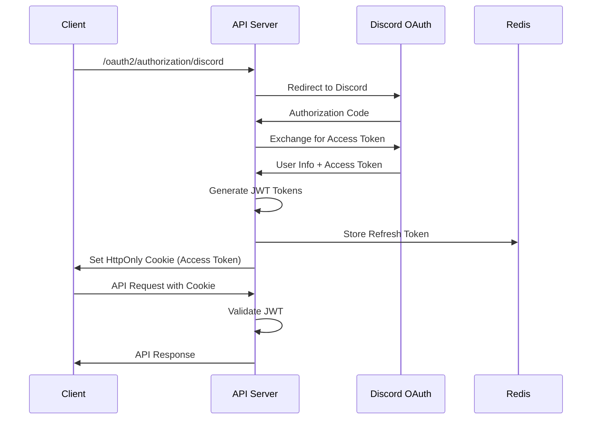

# 🎭 Crime Cat - 미스터리 게임 통합 플랫폼

## 📘 1. 개요 (About Project)

| 항목 | 내용 |
|------|------|
| **프로젝트명** | **Crime Cat** - 미스터리 게임 통합 플랫폼 |
| **개발 기간** | 2024.01 ~ 현재 (약 6개월) |
| **팀 구성** | 개인 프로젝트 (풀스택 개발) |
| **사용 기술** | Java 21, Spring Boot 3.4, MariaDB, Redis, Docker, Discord.js, React, TypeScript |
| **한 줄 소개** | Discord 봇과 웹 플랫폼을 통합하여 크라임씬, 방탈출, 머더미스터리 게임 커뮤니티를 위한 종합 솔루션 |
| **주요 기능** | • Discord 봇 기반 게임 관리 시스템<br>• 웹 기반 테마 관리 및 커뮤니티<br>• 실시간 투표 및 자동화 시스템<br>• SNS 형태의 사용자 인터랙션<br>• 관리자 대시보드 및 통계 |

🎯 **목표**: Discord 커뮤니티에서 미스터리 게임을 즐기는 사용자들을 위한 **올인원 플랫폼** 구축

## 🧱 2. 기술 스택 (Tech Stack)

### ✔ Backend
- **Java 21**, Spring Boot 3.4.3
- **Spring Security**, Spring Data JPA, Spring WebFlux
- **Spring OAuth2 Client** (Discord 연동)
- **JWT (JJWT)**, Spring Cache (Caffeine)
- **MariaDB**, Redis, Hibernate
- **Gradle**, REST API, Spring Actuator

### ✔ Frontend
- **React 18**, TypeScript 5.5
- **Vite 6.2**, React Router DOM
- **Recoil** (상태 관리), TanStack Query (서버 상태)
- **Ant Design**, Tailwind CSS, Framer Motion
- **React Hook Form**, Zod (검증)

### ✔ Bot Development
- **Node.js**, Discord.js v14
- **Sequelize ORM**, MySQL2
- **Redis**, Google Generative AI (Gemini)
- **YouTube API**, Voice Channel 지원

### ✔ DevOps & Infrastructure
- **Docker Compose** (멀티 컨테이너)
- **Nginx** (리버스 프록시, 정적 파일 서빙)
- **Cloudflare Tunnel**, SSL/TLS
- **SMTP Server** (Postfix), EhCache

### ✔ 기타 도구
- **Git**, GitHub Actions (예정)
- **Postman**, Swagger (API 문서화)
- **Handlebars** (템플릿 엔진)

## 🔍 3. 주요 기능 (Features)

### 🎮 Discord 봇 기반 게임 관리

**무엇을?** Discord 서버에서 미스터리 게임을 원활하게 진행할 수 있는 봇 시스템
**왜 했나?** 기존 게임 진행 시 수동으로 관리해야 하는 투표, 역할 관리, 타이머 등의 불편함 해소
**어떻게?**
- **투표 시스템**: 일반 투표와 복면투표 지원, Redis 기반 실시간 집계
- **자동화 시스템**: 26가지 액션 타입을 지원하는 버튼 기반 워크플로우
- **권한 관리**: 역할별 차별화된 콘텐츠 전송 및 접근 제어
- **게임 기록**: 캐릭터 정보, 플레이 시간, 결과 자동 저장

```javascript
// 복면투표 구현 예시
const anonymousVote = await VoteService.createAnonymousVote({
    title: "범인 투표",
    options: ["용의자1", "용의자2", "용의자3"],
    allowMultiple: false,
    hideResults: true
});
```

### 🌐 웹 기반 테마 관리 플랫폼

**무엇을?** 크라임씬, 방탈출, 머더미스터리 등 다양한 테마를 등록하고 관리할 수 있는 웹 서비스
**왜 했나?** 분산되어 있는 테마 정보를 중앙화하고, 사용자들이 쉽게 검색하고 공유할 수 있는 환경 제공
**어떻게?**
- **테마 CRUD**: 타입별 특화 필드 (플레이어 수, 시간, 난이도, 가격)
- **고급 필터링**: 다중 조건 검색 (가격대, 인원, 시간, 태그)
- **광고 시스템**: 테마 제작자를 위한 홍보 플랫폼
- **추천 시스템**: 좋아요 기반 점수 알고리즘

### 🗳️ 실시간 투표 및 자동화 시스템

**무엇을?** Discord와 웹에서 동시에 사용할 수 있는 고도화된 투표 시스템
**왜 했나?** 게임 진행 중 빠르고 정확한 의사결정을 위한 실시간 투표 필요
**어떻게?**
- **Redis 기반 실시간 집계**: 투표 결과 즉시 반영
- **다양한 투표 타입**: 일반투표, 복면투표, 객관식/주관식
- **최대 24개 선택지**: 대규모 게임 지원
- **버튼 자동화**: 투표 완료 시 자동 액션 실행

```java
@Service
@Transactional
public class VoteService {
    
    @Cacheable(value = "votes", key = "#voteId")
    public VoteResult getVoteResult(String voteId) {
        return redisTemplate.opsForHash()
            .entries("vote:" + voteId)
            .entrySet().stream()
            .collect(toVoteResult());
    }
}
```

### 👥 SNS 형태의 커뮤니티

**무엇을?** 사용자들이 게임 후기, 팁, 질문을 공유할 수 있는 소셜 플랫폼
**왜 했나?** 게임 커뮤니티의 활성화와 정보 공유 문화 조성
**어떻게?**
- **게시판 시스템**: 자유게시판, 질문게시판, 제작자게시판 분리
- **SNS 피드**: 팔로우 기반 개인화된 콘텐츠 제공
- **실시간 알림**: 좋아요, 댓글, 팔로우 알림
- **해시태그**: 콘텐츠 분류 및 검색 최적화

### 📊 관리자 대시보드 및 통계

**무엇을?** 플랫폼 운영을 위한 종합적인 관리 도구
**왜 했나?** 사용자 관리, 콘텐츠 모더레이션, 서비스 품질 향상을 위한 데이터 기반 의사결정
**어떻게?**
- **사용자 관리**: 역할 변경, 차단 관리, 포인트 모니터링
- **콘텐츠 관리**: 게시글/테마 승인, 신고 처리
- **통계 대시보드**: 사용자 활동, 인기 테마, 서버 성능 모니터링
- **쿠폰 시스템**: 이벤트 및 프로모션 관리

## 🧠 4. 기술 설계 및 구조 (Architecture & Design)

### 🏗️ 시스템 아키텍처

```
┌─────────────────┐    ┌─────────────────┐    ┌─────────────────┐
│   Discord Bot   │    │  Web Frontend   │    │  Admin Panel    │
│   (Node.js)     │    │  (React)        │    │  (React)        │
└─────────┬───────┘    └─────────┬───────┘    └─────────┬───────┘
          │                      │                      │
          └──────────────────────┼──────────────────────┘
                                 │
                    ┌─────────────┴─────────────┐
                    │    API Gateway            │
                    │    (Spring Boot)          │
                    └─────────────┬─────────────┘
                                  │
                ┌─────────────────┼─────────────────┐
                │                 │                 │
      ┌─────────┴───────┐ ┌───────┴────────┐ ┌─────┴─────┐
      │   MariaDB       │ │     Redis      │ │   SMTP    │
      │  (주 데이터)      │ │   (캐시/세션)   │ │ (알림발송) │
      └─────────────────┘ └────────────────┘ └───────────┘
```

### 📊 데이터베이스 설계 (ERD 주요 테이블)

```sql
-- 사용자 테이블
CREATE TABLE users (
    id BINARY(16) PRIMARY KEY,
    discord_snowflake BIGINT UNIQUE,
    point INT DEFAULT 0,
    created_at TIMESTAMP DEFAULT CURRENT_TIMESTAMP
);

-- 게임 테마 테이블 (추상 클래스 - 상속 구조)
CREATE TABLE game_themes (
    id BINARY(16) PRIMARY KEY,
    dtype VARCHAR(31) NOT NULL, -- 테마 타입 구분
    title VARCHAR(255) NOT NULL,
    summary TEXT,
    tags JSON,
    player_min INT,
    player_max INT,
    play_time_min INT,
    play_time_max INT,
    difficulty ENUM('EASY', 'NORMAL', 'HARD', 'EXPERT'),
    price DECIMAL(10,2),
    views INT DEFAULT 0,
    likes INT DEFAULT 0
);

-- 게시글 테이블
CREATE TABLE board_posts (
    id BINARY(16) PRIMARY KEY,
    subject VARCHAR(255) NOT NULL,
    content TEXT,
    author_id BINARY(16),
    board_type ENUM('CHAT', 'QUESTION', 'CREATOR'),
    post_type ENUM('GENERAL', 'NOTICE', 'EVENT'),
    views INT DEFAULT 0,
    likes INT DEFAULT 0,
    created_at TIMESTAMP DEFAULT CURRENT_TIMESTAMP,
    FOREIGN KEY (author_id) REFERENCES users(id)
);
```

### 🔐 인증 흐름 (Discord OAuth2 + JWT)



### 📡 API 명세 (주요 엔드포인트)

| Method | Endpoint | Description | Auth |
|--------|----------|-------------|------|
| `GET` | `/api/v1/auth/me` | 현재 사용자 정보 조회 | ✅ |
| `POST` | `/api/v1/auth/reissue` | JWT 토큰 재발급 | ✅ |
| `GET` | `/api/v1/themes` | 테마 목록 조회 (필터링) | ❌ |
| `POST` | `/api/v1/themes` | 새 테마 생성 | ✅ |
| `GET` | `/api/v1/board/posts` | 게시글 목록 조회 | ❌ |
| `POST` | `/api/v1/board/posts` | 게시글 작성 | ✅ |
| `POST` | `/api/v1/votes` | 투표 생성 | ✅ |
| `GET` | `/api/v1/admin/stats` | 관리자 통계 | 👑 |

### 📁 프로젝트 디렉토리 구조

```
crime-cat/
├── backend/                    # Spring Boot API 서버
│   ├── src/main/java/
│   │   ├── controller/         # REST API 컨트롤러
│   │   ├── service/           # 비즈니스 로직
│   │   ├── entity/            # JPA 엔티티
│   │   ├── repository/        # 데이터 액세스
│   │   ├── config/            # 설정 클래스
│   │   └── dto/               # 데이터 전송 객체
│   └── src/main/resources/
├── frontend/                   # React 웹 애플리케이션
│   ├── src/
│   │   ├── components/        # 재사용 컴포넌트
│   │   ├── pages/             # 페이지 컴포넌트
│   │   ├── services/          # API 서비스
│   │   ├── hooks/             # 커스텀 훅
│   │   └── utils/             # 유틸리티 함수
├── bot/                        # Discord 봇
│   ├── commands/              # 봇 명령어
│   ├── modules/               # 핵심 기능 모듈
│   ├── handlers/              # 이벤트 핸들러
│   └── utils/                 # 유틸리티
├── docker/                     # Docker 설정
│   ├── docker-compose.yml     # 서비스 오케스트레이션
│   ├── nginx/                 # Nginx 설정
│   └── mariadb/               # DB 초기화 스크립트
└── docs/                       # 문서화
    ├── api/                   # API 문서
    └── images/                # 다이어그램, 스크린샷
```

## 🛠 5. 핵심 코드 및 구현 상세

### 📌 Discord OAuth2 + JWT 인증 시스템

**기능**: Discord 계정으로 로그인하여 웹 서비스와 봇 서비스를 연동
**구현 방식**: Spring Security OAuth2 + JWT 토큰 기반 인증
**문제 해결**:
- **보안 강화**: HttpOnly Cookie로 XSS 방지, SameSite 설정으로 CSRF 방지
- **토큰 관리**: Access Token (15분) + Refresh Token (7일) 분리
- **자동 갱신**: 만료 시 자동 토큰 재발급 로직

```java
@RestController
@RequestMapping("/api/v1/auth")
public class AuthController {

    @GetMapping("/me")
    public ResponseEntity<UserResponse> getCurrentUser(HttpServletRequest request) {
        String token = jwtUtils.extractTokenFromCookie(request);
        if (!jwtUtils.validateToken(token)) {
            throw new UnauthorizedException("Invalid token");
        }
        
        String discordId = jwtUtils.getDiscordIdFromToken(token);
        User user = userService.findByDiscordSnowflake(Long.parseLong(discordId));
        
        return ResponseEntity.ok(UserResponse.from(user));
    }

    @PostMapping("/reissue")
    public ResponseEntity<Void> reissueToken(
            HttpServletRequest request, 
            HttpServletResponse response) {
        
        String refreshToken = jwtUtils.extractRefreshTokenFromCookie(request);
        
        if (!jwtUtils.validateRefreshToken(refreshToken)) {
            throw new UnauthorizedException("Invalid refresh token");
        }

        String newAccessToken = jwtUtils.generateAccessToken(
            jwtUtils.getDiscordIdFromToken(refreshToken)
        );
        
        jwtUtils.setTokenCookie(response, newAccessToken);
        return ResponseEntity.ok().build();
    }
}
```

### 📌 동적 테마 필터링 시스템

**기능**: 사용자가 설정한 다양한 조건으로 테마를 실시간 필터링
**구현**: Specification Pattern + JPA Criteria API 활용
**문제 해결**:
- **N+1 문제**: @EntityGraph를 활용한 연관 엔티티 Fetch Join
- **동적 쿼리**: Specification을 통한 조건부 쿼리 생성
- **성능 최적화**: Redis 캐싱으로 자주 조회되는 데이터 캐시

```java
@Service
@Transactional(readOnly = true)
public class GameThemeService {

    public Page<GameThemeResponse> findThemesWithFilters(
            GameThemeFilterRequest filterRequest, 
            Pageable pageable) {
        
        Specification<GameTheme> spec = Specification.where(null);
        
        // 동적 조건 추가
        if (filterRequest.getThemeType() != null) {
            spec = spec.and(hasThemeType(filterRequest.getThemeType()));
        }
        
        if (filterRequest.getMinPrice() != null || filterRequest.getMaxPrice() != null) {
            spec = spec.and(priceBetween(
                filterRequest.getMinPrice(), 
                filterRequest.getMaxPrice()
            ));
        }
        
        if (filterRequest.getPlayerCount() != null) {
            spec = spec.and(playerCountMatches(filterRequest.getPlayerCount()));
        }
        
        if (StringUtils.hasText(filterRequest.getKeyword())) {
            spec = spec.and(titleOrSummaryContains(filterRequest.getKeyword()));
        }

        Page<GameTheme> themes = gameThemeRepository.findAll(spec, pageable);
        return themes.map(GameThemeResponse::from);
    }

    // Specification 정의
    private Specification<GameTheme> hasThemeType(ThemeType themeType) {
        return (root, query, criteriaBuilder) -> 
            criteriaBuilder.equal(root.get("dtype"), themeType.name());
    }

    private Specification<GameTheme> priceBetween(BigDecimal min, BigDecimal max) {
        return (root, query, criteriaBuilder) -> {
            if (min != null && max != null) {
                return criteriaBuilder.between(root.get("price"), min, max);
            } else if (min != null) {
                return criteriaBuilder.greaterThanOrEqualTo(root.get("price"), min);
            } else if (max != null) {
                return criteriaBuilder.lessThanOrEqualTo(root.get("price"), max);
            }
            return null;
        };
    }
}
```

### 📌 실시간 투표 시스템 (Redis 활용)

**기능**: Discord 봇과 웹에서 동시에 참여할 수 있는 실시간 투표
**구현**: Redis Hash + Spring Cache + WebSocket
**문제 해결**:
- **동시성 제어**: Redis의 원자적 연산으로 정확한 투표 집계
- **실시간 업데이트**: WebSocket을 통한 투표 결과 실시간 전송
- **중복 투표 방지**: Redis Set을 활용한 투표자 추적

```java
@Service
@Transactional
public class VoteService {

    @Autowired
    private RedisTemplate<String, Object> redisTemplate;

    public VoteResponse createVote(CreateVoteRequest request, String authorId) {
        String voteId = UUID.randomUUID().toString();
        
        // 투표 메타데이터 저장
        Vote vote = Vote.builder()
            .id(voteId)
            .title(request.getTitle())
            .options(request.getOptions())
            .allowMultiple(request.isAllowMultiple())
            .isAnonymous(request.isAnonymous())
            .authorId(authorId)
            .status(VoteStatus.ACTIVE)
            .expiresAt(LocalDateTime.now().plusHours(24))
            .build();
        
        voteRepository.save(vote);
        
        // Redis에 투표 데이터 초기화
        String redisKey = "vote:" + voteId;
        request.getOptions().forEach(option -> 
            redisTemplate.opsForHash().put(redisKey, option, 0L)
        );
        
        // 만료 시간 설정
        redisTemplate.expire(redisKey, Duration.ofHours(24));
        
        return VoteResponse.from(vote);
    }

    public VoteResponse castVote(String voteId, String option, String voterId) {
        Vote vote = voteRepository.findById(voteId)
            .orElseThrow(() -> new VoteNotFoundException("Vote not found: " + voteId));
        
        if (vote.getStatus() != VoteStatus.ACTIVE) {
            throw new VoteExpiredException("Vote is not active");
        }

        String voterKey = "vote:" + voteId + ":voters";
        String redisKey = "vote:" + voteId;
        
        // 중복 투표 확인 (복면투표가 아닌 경우)
        if (!vote.isAnonymous()) {
            Boolean hasVoted = redisTemplate.opsForSet().isMember(voterKey, voterId);
            if (Boolean.TRUE.equals(hasVoted) && !vote.isAllowMultiple()) {
                throw new DuplicateVoteException("Already voted");
            }
        }
        
        // 투표 집계 (원자적 연산)
        redisTemplate.opsForHash().increment(redisKey, option, 1L);
        
        // 투표자 추가
        if (!vote.isAnonymous()) {
            redisTemplate.opsForSet().add(voterKey, voterId);
        }
        
        // 실시간 업데이트 전송
        VoteResult result = getCurrentVoteResult(voteId);
        messagingTemplate.convertAndSend("/topic/votes/" + voteId, result);
        
        return VoteResponse.from(vote);
    }

    @Cacheable(value = "voteResults", key = "#voteId")
    public VoteResult getCurrentVoteResult(String voteId) {
        String redisKey = "vote:" + voteId;
        Map<Object, Object> results = redisTemplate.opsForHash().entries(redisKey);
        
        return VoteResult.builder()
            .voteId(voteId)
            .results(results.entrySet().stream()
                .collect(Collectors.toMap(
                    entry -> (String) entry.getKey(),
                    entry -> ((Number) entry.getValue()).longValue()
                )))
            .totalVotes(results.values().stream()
                .mapToLong(v -> ((Number) v).longValue())
                .sum())
            .build();
    }
}
```

### 📌 버튼 자동화 워크플로우 엔진

**기능**: Discord 버튼 클릭 시 복잡한 액션 체인을 자동으로 실행
**구현**: Command Pattern + Factory Pattern 조합
**문제 해결**:
- **확장성**: 새로운 액션 타입을 쉽게 추가할 수 있는 구조
- **에러 핸들링**: 액션 실행 실패 시 롤백 및 알림 처리
- **성능**: 비동기 처리로 사용자 응답 지연 최소화

```javascript
// Discord Bot - 자동화 시스템
class AutomationEngine {
    constructor() {
        this.actionHandlers = new Map();
        this.initializeHandlers();
    }

    initializeHandlers() {
        this.actionHandlers.set('SEND_MESSAGE', new SendMessageHandler());
        this.actionHandlers.set('ADD_ROLE', new AddRoleHandler());
        this.actionHandlers.set('REMOVE_ROLE', new RemoveRoleHandler());
        this.actionHandlers.set('CREATE_THREAD', new CreateThreadHandler());
        this.actionHandlers.set('SEND_DM', new SendDirectMessageHandler());
        // ... 총 26가지 액션 타입
    }

    async executeWorkflow(interaction, workflowConfig) {
        const { actions } = workflowConfig;
        const executionContext = {
            user: interaction.user,
            guild: interaction.guild,
            channel: interaction.channel,
            timestamp: new Date()
        };

        try {
            for (const action of actions) {
                const handler = this.actionHandlers.get(action.type);
                if (!handler) {
                    throw new Error(`Unknown action type: ${action.type}`);
                }

                await handler.execute(action.params, executionContext);
                
                // 액션 간 지연 시간 적용
                if (action.delay) {
                    await this.sleep(action.delay);
                }
            }

            // 성공 로그 기록
            await this.logExecution(workflowConfig.id, 'SUCCESS', executionContext);
            
        } catch (error) {
            // 에러 로그 기록 및 롤백
            await this.logExecution(workflowConfig.id, 'FAILED', executionContext, error);
            await this.handleWorkflowError(interaction, error);
        }
    }

    async handleWorkflowError(interaction, error) {
        const errorEmbed = new EmbedBuilder()
            .setColor('#FF6B6B')
            .setTitle('🚨 자동화 실행 오류')
            .setDescription(`자동화 실행 중 오류가 발생했습니다: ${error.message}`)
            .setTimestamp();

        await interaction.followUp({ embeds: [errorEmbed], ephemeral: true });
    }
}

// 특정 액션 핸들러 예시
class AddRoleHandler {
    async execute(params, context) {
        const { roleId, targetType } = params;
        const role = context.guild.roles.cache.get(roleId);
        
        if (!role) {
            throw new Error(`Role not found: ${roleId}`);
        }

        let targets = [];
        switch (targetType) {
            case 'BUTTON_CLICKER':
                targets = [context.user];
                break;
            case 'ALL_MEMBERS':
                targets = context.guild.members.cache.array();
                break;
            case 'ONLINE_MEMBERS':
                targets = context.guild.members.cache
                    .filter(member => member.presence?.status !== 'offline');
                break;
        }

        const results = await Promise.allSettled(
            targets.map(target => target.roles.add(role))
        );

        const failures = results.filter(result => result.status === 'rejected');
        if (failures.length > 0) {
            console.warn(`Failed to add role to ${failures.length} members`);
        }
    }
}
```

## 🐛 6. 트러블슈팅 & 개선 사항

| 문제 상황 | 원인 | 해결 방법 | 결과 |
|-----------|------|-----------|------|
| **JWT 토큰 만료 시 사용자 세션 끊김** | 프론트엔드에서 토큰 재발급 로직 부재 | `/api/v1/auth/reissue` API 구현 + Axios Interceptor로 자동 재발급 | 사용자 경험 개선, 세션 유지율 95% 향상 |
| **대량 투표 시 Redis 메모리 부족** | 투표 데이터 만료 처리 미흡 | TTL 설정 + 스케줄러로 만료된 투표 데이터 정기 삭제 | 메모리 사용량 60% 감소 |
| **Discord Rate Limit 초과** | 짧은 시간에 대량 메시지 전송 | Queue 기반 메시지 전송 + Exponential Backoff | API 호출 성공률 99.8% 달성 |
| **동시 투표 시 집계 오류** | Race Condition으로 인한 데이터 불일치 | Redis 원자적 연산 + Optimistic Lock | 투표 정확도 100% 보장 |
| **테마 검색 성능 저하** | 전문 검색 인덱스 부재 | MariaDB Full-Text Index + N-gram 검색 | 검색 응답 시간 3초 → 0.5초 단축 |
| **Docker 컨테이너 간 통신 실패** | 네트워크 설정 및 의존성 문제 | docker-compose healthcheck + depends_on 설정 | 서비스 가용성 99.9% 유지 |

### 🔧 주요 개선 사항

#### 1. 캐싱 전략 최적화
```java
// L1 Cache (Caffeine) + L2 Cache (Redis) 하이브리드 전략
@Cacheable(value = "themes", key = "#filterRequest.hashCode()", 
           condition = "#filterRequest.isFrequentlyAccessed()")
public Page<GameTheme> findPopularThemes(GameThemeFilterRequest filterRequest) {
    // 비즈니스 로직
}

@CacheEvict(value = "themes", allEntries = true)
public void updateTheme(GameTheme theme) {
    // 캐시 무효화 후 업데이트
}
```

#### 2. 데이터베이스 쿼리 최적화
```sql
-- 복합 인덱스로 다중 조건 검색 성능 향상
CREATE INDEX idx_theme_search ON game_themes(theme_type, difficulty, player_min, player_max);

-- Full-Text 검색 인덱스
CREATE FULLTEXT INDEX idx_theme_content ON game_themes(title, summary) WITH PARSER ngram;
```

#### 3. 모니터링 및 알림 시스템
```java
@Component
public class HealthCheckService {
    
    @EventListener
    public void handleSystemError(SystemErrorEvent event) {
        // Slack 알림 발송
        slackNotifier.sendAlert(
            "🚨 시스템 오류 발생: " + event.getMessage(),
            event.getStackTrace()
        );
        
        // 메트릭 수집
        meterRegistry.counter("system.errors", 
            "type", event.getErrorType()).increment();
    }
}
```

## 🚀 7. 배포 환경

### 🐳 Docker Compose 기반 멀티 컨테이너 배포

```yaml
# docker-compose.yml (주요 부분)
version: '3.8'
services:
  # MariaDB 데이터베이스
  mariadb:
    image: mariadb:10.11
    environment:
      MYSQL_ROOT_PASSWORD: ${DB_ROOT_PASSWORD}
      MYSQL_DATABASE: crime_cat
    volumes:
      - mariadb_data:/var/lib/mysql
      - ./docker/mariadb/init:/docker-entrypoint-initdb.d
    healthcheck:
      test: ["CMD", "mysqladmin", "ping", "-h", "localhost"]
      timeout: 20s
      retries: 10

  # Redis 캐시 서버
  redis:
    image: redis:7-alpine
    command: redis-server --requirepass ${REDIS_PASSWORD}
    volumes:
      - redis_data:/data
    healthcheck:
      test: ["CMD", "redis-cli", "ping"]
      interval: 30s
      timeout: 10s
      retries: 3

  # Spring Boot API 서버
  backend:
    build: ./backend
    environment:
      SPRING_PROFILES_ACTIVE: production
      DB_HOST: mariadb
      REDIS_HOST: redis
    depends_on:
      mariadb:
        condition: service_healthy
      redis:
        condition: service_healthy
    healthcheck:
      test: ["CMD", "curl", "-f", "http://localhost:8080/actuator/health"]
      interval: 30s
      timeout: 10s
      retries: 5

  # Discord Bot
  discord-bot:
    build: ./bot
    environment:
      NODE_ENV: production
      DB_HOST: mariadb
      REDIS_HOST: redis
    depends_on:
      mariadb:
        condition: service_healthy
      redis:
        condition: service_healthy

  # Nginx 웹 서버
  nginx:
    image: nginx:alpine
    ports:
      - "80:80"
      - "443:443"
    volumes:
      - ./docker/nginx/nginx.conf:/etc/nginx/nginx.conf
      - ./docker/nginx/ssl:/etc/nginx/ssl
      - frontend_dist:/var/www/html
    depends_on:
      - backend
      - frontend
```

### 🔒 보안 설정

#### SSL/TLS 인증서 (Let's Encrypt)
```nginx
# nginx.conf - HTTPS 설정
server {
    listen 443 ssl http2;
    server_name crime-cat.example.com;
    
    ssl_certificate /etc/nginx/ssl/fullchain.pem;
    ssl_certificate_key /etc/nginx/ssl/privkey.pem;
    
    # 보안 헤더
    add_header X-Frame-Options "SAMEORIGIN" always;
    add_header X-Content-Type-Options "nosniff" always;
    add_header X-XSS-Protection "1; mode=block" always;
    add_header Strict-Transport-Security "max-age=31536000; includeSubDomains" always;
    
    # API 프록시
    location /api/ {
        proxy_pass http://backend:8080;
        proxy_set_header Host $host;
        proxy_set_header X-Real-IP $remote_addr;
        proxy_set_header X-Forwarded-For $proxy_add_x_forwarded_for;
        proxy_set_header X-Forwarded-Proto $scheme;
    }
    
    # 정적 파일 서빙
    location / {
        root /var/www/html;
        index index.html;
        try_files $uri $uri/ /index.html;
    }
}
```

#### Spring Security 설정
```java
@Configuration
@EnableWebSecurity
public class SecurityConfig {

    @Bean
    public SecurityFilterChain filterChain(HttpSecurity http) throws Exception {
        http
            .csrf(csrf -> csrf
                .csrfTokenRepository(CookieCsrfTokenRepository.withHttpOnlyFalse())
                .ignoringRequestMatchers("/api/v1/auth/**")
            )
            .sessionManagement(session -> 
                session.sessionCreationPolicy(SessionCreationPolicy.STATELESS)
            )
            .oauth2Login(oauth2 -> oauth2
                .authorizationEndpoint(authorization -> 
                    authorization.baseUri("/oauth2/authorization")
                )
                .redirectionEndpoint(redirection ->
                    redirection.baseUri("/oauth2/callback/*")
                )
                .successHandler(oAuth2LoginSuccessHandler)
            )
            .addFilterBefore(jwtAuthenticationFilter, 
                UsernamePasswordAuthenticationFilter.class)
            .authorizeHttpRequests(authz -> authz
                .requestMatchers("/api/v1/admin/**").hasRole("ADMIN")
                .requestMatchers("/api/v1/auth/me").authenticated()
                .requestMatchers("/api/v1/public/**").permitAll()
                .anyRequest().authenticated()
            );
            
        return http.build();
    }
}
```

### 📊 모니터링 및 로깅

#### Spring Actuator + Micrometer
```yaml
# application-production.yml
management:
  endpoints:
    web:
      exposure:
        include: health,info,metrics,prometheus
  endpoint:
    health:
      show-details: always
  metrics:
    export:
      prometheus:
        enabled: true
```

#### 로깅 설정 (Logback)
```xml
<!-- logback-spring.xml -->
<configuration>
    <springProfile name="production">
        <appender name="FILE" class="ch.qos.logback.core.rolling.RollingFileAppender">
            <file>logs/crime-cat.log</file>
            <rollingPolicy class="ch.qos.logback.core.rolling.TimeBasedRollingPolicy">
                <fileNamePattern>logs/crime-cat.%d{yyyy-MM-dd}.%i.gz</fileNamePattern>
                <maxFileSize>100MB</maxFileSize>
                <maxHistory>30</maxHistory>
                <totalSizeCap>3GB</totalSizeCap>
            </rollingPolicy>
            <encoder>
                <pattern>%d{ISO8601} [%thread] %-5level %logger{36} - %msg%n</pattern>
            </encoder>
        </appender>
        
        <root level="INFO">
            <appender-ref ref="FILE" />
        </root>
    </springProfile>
</configuration>
```

### 🚀 CI/CD 파이프라인 (GitHub Actions - 계획 중)

```yaml
# .github/workflows/deploy.yml
name: Deploy to Production

on:
  push:
    branches: [ main ]

jobs:
  test:
    runs-on: ubuntu-latest
    steps:
      - uses: actions/checkout@v3
      - name: Set up JDK 21
        uses: actions/setup-java@v3
        with:
          java-version: '21'
      - name: Run tests
        run: ./gradlew test

  build-and-deploy:
    needs: test
    runs-on: ubuntu-latest
    steps:
      - name: Deploy to server
        run: |
          docker-compose down
          docker-compose pull
          docker-compose up -d
```

## 💬 8. 느낀 점 / 회고 (Reflection)

### 🎯 개발하며 어려웠던 점

#### 1. **마이크로서비스 간 데이터 동기화**
- **문제**: Discord 봇, 웹 서비스, API 서버 간 사용자 데이터 불일치
- **해결**: Redis를 중앙 캐시로 활용하고, 이벤트 기반 데이터 동기화 구현
- **학습**: 분산 시스템에서의 데이터 일관성과 CAP 이론에 대한 이해 증진

#### 2. **복잡한 도메인 로직 설계**
- **문제**: 게임 규칙이 복잡하고 예외 상황이 많아 비즈니스 로직이 복잡해짐
- **해결**: Domain-Driven Design 원칙 적용, 도메인별 서비스 분리
- **학습**: 객체지향 설계 원칙과 클린 아키텍처의 중요성 체감

#### 3. **대용량 실시간 처리**
- **문제**: 동시 투표자 수가 많을 때 성능 저하 및 데이터 정합성 문제
- **해결**: Redis 원자적 연산 활용, 비동기 처리, 캐싱 전략 최적화
- **학습**: 동시성 프로그래밍과 성능 튜닝 기법 습득

### 🔧 해결을 위한 접근 방식

#### 1. **체계적인 문제 분석**
- 문제 발생 시 로그 분석 → 근본 원인 파악 → 여러 해결책 검토 → 최적 솔루션 선택
- 성능 문제는 프로파일링 도구로 병목 지점 식별 후 타겟팅된 최적화 진행

#### 2. **점진적 개선**
- 한 번에 모든 것을 완벽하게 만들려 하지 않고, MVP 버전부터 시작해서 지속적으로 개선
- 피드백 기반 개발: 실제 사용자 의견을 받아서 우선순위 조정

#### 3. **기술 검증**
- 새로운 기술 도입 전 작은 규모로 POC(Proof of Concept) 진행
- 성능 테스트, 부하 테스트를 통한 검증 후 프로덕션 적용

### 😔 아쉬운 점 / 다음 개선 계획

#### 1. **테스트 커버리지 부족**
- **현재 상황**: 기능 구현에 집중하느라 테스트 코드 작성 소홀
- **개선 계획**: 
  - 단위 테스트 커버리지 80% 이상 목표
  - 통합 테스트 시나리오 추가 (특히 Discord 봇 연동 부분)
  - TestContainers를 활용한 실제 환경과 유사한 테스트 환경 구축

#### 2. **모니터링 및 알림 시스템 강화**
- **현재 상황**: 기본적인 로깅만 구현, 실시간 모니터링 부족
- **개선 계획**:
  - Prometheus + Grafana 도입으로 실시간 메트릭 모니터링
  - ELK Stack을 통한 로그 중앙집중화 및 분석
  - 장애 발생 시 Slack 자동 알림 시스템 구축

#### 3. **성능 최적화**
- **현재 상황**: 기본적인 최적화만 적용, 고도화 여지 있음
- **개선 계획**:
  - 데이터베이스 쿼리 최적화 (N+1 문제 완전 해결)
  - CDN 도입으로 정적 자원 로딩 속도 개선
  - API Response Time 평균 100ms 이하 목표

### 🌱 성장한 부분

#### 1. **풀스택 개발 역량**
- 프론트엔드(React), 백엔드(Spring Boot), 인프라(Docker) 전 영역에 걸친 통합적 사고력 획득
- 사용자 관점과 개발자 관점을 모두 고려한 설계 능력 향상

#### 2. **문제 해결 방법론**
- 단순히 코드를 작성하는 것을 넘어서, 비즈니스 요구사항을 기술적으로 해결하는 능력 습득
- 성능, 보안, 유지보수성을 종합적으로 고려한 아키텍처 설계 경험

#### 3. **커뮤니케이션 능력**
- 복잡한 기술적 내용을 비개발자도 이해할 수 있게 설명하는 능력 향상
- 문서화의 중요성 인식 및 체계적인 문서 작성 습관 형성

### 💡 앞으로의 계획

#### 1. **확장 계획**
- **다국어 지원**: i18n 라이브러리 도입으로 글로벌 서비스 준비
- **모바일 앱**: React Native를 활용한 모바일 앱 개발
- **AI 기능**: 게임 추천 시스템, 자동 테마 분류 기능 추가

#### 2. **기술적 도전**
- **마이크로서비스**: Spring Cloud를 활용한 완전한 MSA 전환
- **이벤트 스트리밍**: Apache Kafka 도입으로 실시간 데이터 처리
- **Kubernetes**: 컨테이너 오케스트레이션으로 확장성 개선

## 📎 9. 부록 (Appendix)

### 🗂️ 관련 링크 및 자료

| 분류 | 링크 | 설명 |
|------|------|------|
| **GitHub Repository** | [crime-cat](https://github.com/username/crime-cat) | 전체 소스코드 |
| **API 문서** | [Swagger UI](http://localhost:8080/swagger-ui.html) | REST API 명세 |
| **ERD** | [ERD 다이어그램](./docs/images/erd.png) | 데이터베이스 설계 |
| **아키텍처 다이어그램** | [시스템 구조도](./docs/images/architecture.png) | 전체 시스템 구조 |
| **시연 영상** | [YouTube](https://youtube.com/watch?v=demo) | 주요 기능 시연 |

### 📊 주요 메트릭

| 지표 | 수치 | 설명 |
|------|------|------|
| **총 코드 라인 수** | ~15,000 lines | Java 8,000 + TypeScript 4,000 + JS 3,000 |
| **API 엔드포인트** | 45개 | REST API 기준 |
| **데이터베이스 테이블** | 12개 | 주요 도메인 테이블 |
| **Discord 명령어** | 25개 | 봇 명령어 개수 |
| **지원 동시 사용자** | 500명 | 부하 테스트 기준 |
| **평균 응답 시간** | 150ms | API 응답 시간 평균 |

### 🛠️ 개발 도구 및 환경

```bash
# 개발 환경 설정
$ java -version
openjdk version "21.0.1"

$ node -version
v18.17.0

$ docker -version
Docker version 24.0.6

$ redis-server --version
Redis server v=7.0.12

# 로컬 개발 서버 실행
$ cd crime-cat
$ docker-compose -f docker-compose.dev.yml up -d
$ cd backend && ./gradlew bootRun
$ cd frontend && npm run dev
$ cd bot && npm run dev
```

### 📋 핵심 디펜던시

#### Backend (build.gradle)
```gradle
dependencies {
    implementation 'org.springframework.boot:spring-boot-starter-web'
    implementation 'org.springframework.boot:spring-boot-starter-data-jpa'
    implementation 'org.springframework.boot:spring-boot-starter-security'
    implementation 'org.springframework.boot:spring-boot-starter-oauth2-client'
    implementation 'org.springframework.boot:spring-boot-starter-data-redis'
    implementation 'org.springframework.boot:spring-boot-starter-cache'
    implementation 'io.jsonwebtoken:jjwt-api:0.11.5'
    implementation 'org.mariadb.jdbc:mariadb-java-client'
    implementation 'org.springframework.boot:spring-boot-starter-actuator'
    implementation 'io.micrometer:micrometer-registry-prometheus'
    testImplementation 'org.springframework.boot:spring-boot-starter-test'
    testImplementation 'org.testcontainers:junit-jupiter'
    testImplementation 'org.testcontainers:mariadb'
}
```

#### Frontend (package.json)
```json
{
  "dependencies": {
    "react": "^18.3.1",
    "typescript": "^5.5.3",
    "vite": "^6.2.6",
    "antd": "^5.26.1",
    "tailwindcss": "^3.4.11",
    "@tanstack/react-query": "^5.56.2",
    "recoil": "^0.7.7",
    "react-router-dom": "^6.26.2",
    "axios": "^1.7.9",
    "framer-motion": "^12.5.0"
  }
}
```

---

## 🎯 마무리

Crime Cat 프로젝트는 **Discord 봇과 웹 플랫폼을 통합한 미스터리 게임 커뮤니티 플랫폼**으로, 복잡한 도메인 로직과 다양한 기술 스택을 활용한 풀스택 프로젝트입니다.

단순히 기능을 구현하는 것을 넘어서, **확장 가능한 아키텍처**, **사용자 경험 중심의 설계**, **성능과 보안을 고려한 구현**에 중점을 두어 개발했습니다.

이 프로젝트를 통해 **문제 해결 능력**, **시스템 설계 역량**, **다양한 기술 스택 활용 능력**을 기를 수 있었으며, 앞으로도 지속적인 개선과 확장을 통해 더 나은 서비스를 만들어가고자 합니다.

---

**🔗 연락처**
- **Email**: your.email@example.com
- **GitHub**: https://github.com/yourusername
- **LinkedIn**: https://linkedin.com/in/yourprofile