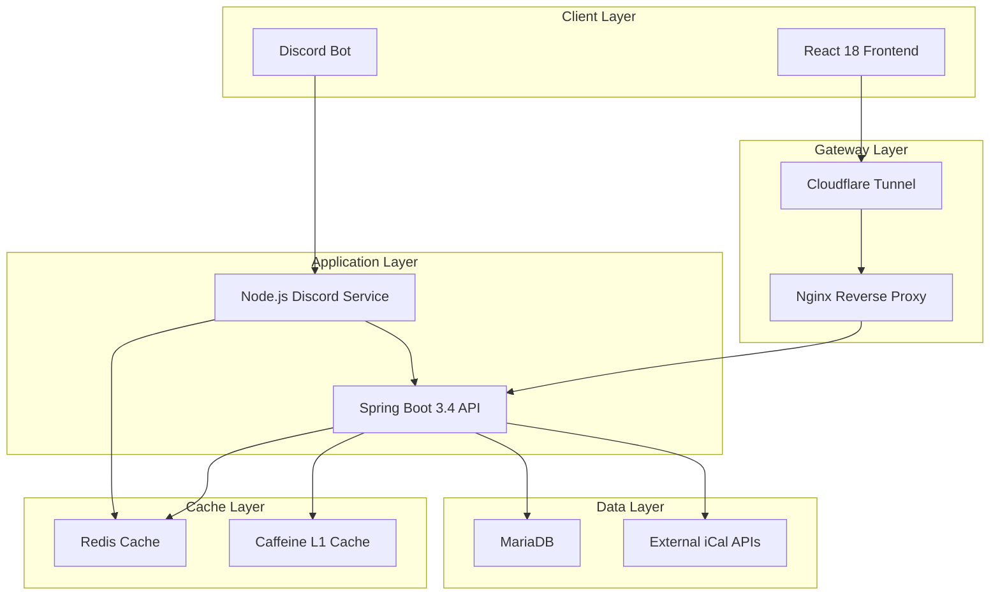

# Crime-Cat 🐱
프로젝트 웹페이지 [미스터리 플레이스](https://mystery-place.com)
> **종합 엔터테인먼트 & 커뮤니티 플랫폼** - 게임, 음악, SNS, 일정관리가 하나로 통합된 Discord 기반 올인원 플랫폼

[](https://spring.io/projects/spring-boot)
[](https://reactjs.org/)
[](https://www.typescriptlang.org/)
[](https://discord.js.org/)
[](https://openjdk.org/projects/jdk/21/)
[](https://mariadb.org/)
[](https://redis.io/)
[](https://docs.docker.com/compose/)

## 📋 프로젝트 개요

Crime-Cat은 **Discord 생태계를 중심으로 한 종합 엔터테인먼트 플랫폼**입니다. 방탈출, 크라임씬, 머더미스터리 등 **다양한 게임 테마 관리**부터 **SNS 커뮤니티, 음악 재생, 일정 관리**까지 모든 기능을 하나의 플랫폼에서 제공합니다. **74개의 웹 페이지**와 **70+ Discord 봇 명령어**로 구성된 대규모 프로젝트입니다.

### 🎯 핵심 가치

- **🎮 올인원 엔터테인먼트**: 게임, 음악, SNS, 일정을 하나로
- **🤖 Discord 생태계**: 70+ 봇 명령어로 모든 기능 제어
- **🌐 커뮤니티 중심**: SNS 피드, 팔로우, 해시태그 시스템
- **🎭 게임 특화**: 방탈출, 머더미스터리 등 테마 관리
- **⚡ 고성능**: 3단계 캐싱과 마이크로서비스 아키텍처
- **⚡ 간단 빌드**: makefile 을 이용하여 명령어 한줄로 빌드**

## 🏗️ 시스템 아키텍처



## 🚀 핵심 기능

### 🎮 게임 테마 관리 시스템
- **4가지 테마 지원**: 방탈출, 크라임씬, 머더미스터리, 리얼월드
- **테마별 전용 API**: 각 게임 타입별 최적화된 관리 인터페이스
- **썸네일 관리**: Multipart 파일 업로드로 시각적 테마 관리
- **커뮤니티 기능**: 테마 좋아요/싫어요, 사용자 평가 시스템
- **Discord 연동**: 게임 세션 관리 및 참여자 모집

### 🌐 SNS & 커뮤니티 플랫폼
- **소셜 피드**: 이미지 업로드(최대 5개), 해시태그, 위치 정보
- **프라이버시 제어**: 공개/비공개, 팔로워 전용 게시글 설정
- **팔로우 시스템**: 사용자 간 팔로우/언팔로우 관리
- **상호작용**: 좋아요, 댓글, 게시글 검색 기능
- **갤러리 뷰**: 12개 단위 페이지네이션으로 최적화된 피드

### 🎵 음악 & 엔터테인먼트
- **로컬 음악 재생**: 서버 저장 음악 파일 관리 및 재생
- **YouTube 통합**: YouTube 음악 트랙 연동 및 재생목록 관리
- **길드별 음악**: Discord 서버별 독립적인 음악 라이브러리
- **실시간 재생**: Discord 음성 채널 연동 음악 재생

### 🎭 캐릭터 & 역할 관리
- **캐릭터 시스템**: Discord 길드별 캐릭터 생성 및 관리
- **역할 할당**: 캐릭터별 다중 역할 설정 가능
- **게임 연동**: 방탈출/머더미스터리 게임용 캐릭터 활용
- **길드 관리**: Discord 서버별 독립적인 캐릭터 데이터베이스

### 📅 다중 캘린더 통합 시스템
- **지원 플랫폼**: Google Calendar, Apple iCloud, Outlook, 모든 iCal 호환 서비스
- **실시간 동기화**: 30분 간격 자동 동기화 + 수동 즉시 동기화
- **시각적 구분**: 캘린더별 색상 구분 및 스트라이프 패턴 표시
- **충돌 감지**: 시간 겹침 자동 감지 및 시각적 경고
- **Discord 봇 연동**: `/내일정`, `/일정체크`, `/일정갱신` 명령어

### 🤖 Discord 봇 생태계 (70+ 명령어)
```bash
# 일정 관리
/내일정 개월:3        # 3개월 일정 조회
/일정체크 날짜목록     # 특정 날짜 겹침 확인
/일정갱신             # 캐시 강제 새로고침

# 서버관리
/청소             # 채널 전체 메시지 삭제
/고양이             # 저장한 목록 채널 전체 메시지 삭제
/부여           # 특정 역할,권한 유저에게 부여

# 음악
/귀여워             # 음악 플레이어 생성
/추가             # 유튜브 주소 추가
/제거             # 유튜브 주소 삭제
/파일업로드        # 음악파일및 log 파일 업로드

# 커뮤니티
/주사위             # nDn 다이스 굴림
/커스텀투표             # 유저커스터마이징 투표 폼 생성

```

### 🎨 고급 UI/UX 인터페이스
- **반응형 디자인**: 모바일 퍼스트, 3단계 뷰 모드 (컴팩트/표준/확대)
- **접근성 최적화**: WCAG 2.1 AA 준수, 키보드 네비게이션, 스크린 리더 지원
- **성능 최적화**: 20ms 응답속도 툴팁, 가상화된 리스트, 코드 스플리팅
- **shadcn/ui**: Radix UI 기반 현대적 컴포넌트 시스템
- **Framer Motion**: 부드러운 애니메이션 및 전환 효과

### 💾 지능형 데이터 관리
- **비트맵 날짜 관리**: 90일 → 12바이트 압축 (99% 저장공간 절약)
- **빠른 연산**: 비트 연산을 통한 O(1) 날짜 확인
- **드래그 선택**: 직관적인 날짜 범위 선택 인터페이스
- **파일 저장소**: 이미지, 썸네일, 음악 파일 효율적 관리

### ⚡ 3단계 캐싱 시스템
- **L1 캐시**: Caffeine (애플리케이션 레벨, 고속 메모리 캐시)
- **L2 캐시**: Hibernate 2차 캐시 (ORM 레벨, 엔티티 캐시)
- **L3 캐시**: Redis (분산 캐시, 세션 관리)
- **캐시 무효화**: 데이터 변경 시 자동 무효화 및 실시간 동기화

### 🔐 통합 인증 & 보안
- **이중 인증 시스템**: JWT (웹), Bearer Token (봇), Discord OAuth2
- **역할 기반 접근제어**: 사용자, 관리자, 봇별 권한 분리
- **보안 헤더**: CORS, CSRF 방어, Rate Limiting
- **데이터 암호화**: 민감정보 암호화 및 마스킹

## 🛠️ 기술 스택

### 백엔드 (Spring Boot)
```yaml
플랫폼: Java 21, Spring Boot 3.4.3
프레임워크:
  - Spring Security (OAuth2, JWT)
  - Spring Data JPA (Hibernate)
  - Spring Data Redis
  - Spring WebFlux (WebClient)
  - Spring Actuator (모니터링)

라이브러리:
  - iCal4j 3.2.14 (캘린더 파싱)
  - Caffeine 3.1.6 (L1 캐시)
  - EhCache 3.10.8 (L2 캐시)
  - Thymeleaf (이메일 템플릿)
  - Handlebars (알림 템플릿)

데이터베이스:
  - MariaDB 3.3.2 (메인 DB)
  - Redis (캐시 + 세션)
```

### 프론트엔드 (React)
```yaml
플랫폼: React 18.3.1, TypeScript 5.5.3, Vite 6.2.6
UI 프레임워크:
  - Tailwind CSS 3.4.11
  - shadcn/ui (Radix UI 기반)
  - Framer Motion (애니메이션)

상태 관리:
  - React Query 5.56.2 (서버 상태)
  - Recoil 0.7.7 (클라이언트 상태)

주요 라이브러리:
  - React Hook Form + Zod (폼 검증)
  - date-fns (날짜 처리)
  - React Router 6.26.2
  - Axios (HTTP 클라이언트)
  - React Day Picker (캘린더 UI)
```

### Discord 봇 (Node.js)
```yaml
플랫폼: Node.js, Discord.js 14.16.3
AI 통합:
  - Google Generative AI 0.24.0

음성 처리:
  - @discordjs/voice 0.18.0
  - @discordjs/opus 0.9.0
  - libsodium-wrappers 0.7.15

데이터베이스:
  - Sequelize 6.37.5 (ORM) // 사용중지 (spring backend 에서 관리)
  - MySQL2 3.11.5 (MariaDB 드라이버) //사용중지 (spring backend 에서 관리)
  - Redis 4.7.0 (캐시)
```

### 인프라 & DevOps
```yaml
컨테이너화:
  - Docker + Docker Compose
  - 멀티 스테이지 빌드
  - 헬스체크 내장

웹 서버:
  - Nginx (리버스 프록시)
  - Cloudflare Tunnel (SSL/CDN)

모니터링:
  - JSON 로깅 (구조화된 로그)
  - 로그 로테이션 (크기/개수 제한)
  - Spring Actuator 헬스체크

메일 시스템:
  - SMTP 서버 (Docker) // 미구현
```

## 📊 핵심 성능 지표

### 가용성
- **서비스 가용성**: 99.9% 목표
- **자동 복구**: Docker 헬스체크 기반
- **장애 대응**: 30초 이내 자동 재시작

## 🗄️ 데이터베이스 설계
초기 dberd 설계 [erd 설계링크(erdcloud)](https://www.erdcloud.com/d/yW38rnYBJ5ZRdHp63)
### 핵심 테이블 구조
```sql
-- 게임 테마 관리 (4가지 테마)
game_themes (
    id BINARY(16) PRIMARY KEY,     -- UUID
    theme_type ENUM,               -- escape-room, crimescene, murder-mystery, realworld
    title VARCHAR(200),            -- 테마 제목
    description TEXT,              -- 테마 설명
    thumbnail_url VARCHAR(500),    -- 썸네일 이미지 URL
    difficulty_level INT,          -- 난이도 (1-5)
    max_participants INT,          -- 최대 참여자 수
    created_by BINARY(16),         -- 생성자 ID
    created_at TIMESTAMP,
    updated_at TIMESTAMP
);

-- 테마 좋아요/평가
theme_likes (
    id BIGINT PRIMARY KEY,
    theme_id BINARY(16),           -- 테마 ID
    user_id BINARY(16),            -- 사용자 ID
    created_at TIMESTAMP,
    UNIQUE KEY unique_theme_user (theme_id, user_id)
);

-- SNS 게시글 시스템
user_posts (
    id BINARY(16) PRIMARY KEY,     -- UUID
    user_id BINARY(16),            -- 작성자 ID
    content TEXT,                  -- 게시글 내용
    image_urls JSON,               -- 이미지 URL 배열 (최대 5개)
    hashtags JSON,                 -- 해시태그 배열
    is_private BOOLEAN,            -- 비공개 설정
    is_followers_only BOOLEAN,     -- 팔로워 전용
    location_name VARCHAR(200),    -- 위치명
    latitude DECIMAL(10,8),        -- 위도
    longitude DECIMAL(11,8),       -- 경도
    like_count INT DEFAULT 0,      -- 좋아요 수
    created_at TIMESTAMP,
    updated_at TIMESTAMP
);

-- 팔로우 관계
user_follows (
    id BIGINT PRIMARY KEY,
    follower_id BINARY(16),        -- 팔로워 ID
    following_id BINARY(16),       -- 팔로잉 ID
    created_at TIMESTAMP,
    UNIQUE KEY unique_follow (follower_id, following_id)
);

-- Discord 길드 캐릭터 관리
guild_characters (
    id BIGINT PRIMARY KEY,
    guild_snowflake VARCHAR(20),   -- Discord 길드 ID
    character_name VARCHAR(100),   -- 캐릭터명
    character_roles JSON,          -- 역할 배열
    created_at TIMESTAMP,
    updated_at TIMESTAMP,
    UNIQUE KEY unique_guild_character (guild_snowflake, character_name)
);

-- 음악 파일 관리
music_files (
    id BINARY(16) PRIMARY KEY,     -- UUID
    guild_id VARCHAR(20),          -- Discord 길드 ID
    file_type ENUM,                -- local, youtube
    title VARCHAR(300),            -- 음악 제목
    artist VARCHAR(200),           -- 아티스트
    file_path VARCHAR(1000),       -- 파일 경로 또는 YouTube URL
    duration_seconds INT,          -- 재생 시간 (초)
    created_at TIMESTAMP
);

-- 외부 캘린더 통합
user_calendars (
    id BINARY(16) PRIMARY KEY,     -- UUID
    user_id BINARY(16),            -- 사용자 ID
    ical_url TEXT,                 -- iCal URL
    display_name VARCHAR(100),     -- 표시명
    color_index INT,               -- 색상 인덱스
    sync_status ENUM,              -- 동기화 상태
    last_synced_at TIMESTAMP       -- 마지막 동기화
);

-- 비트맵 날짜 차단 (90일 → 12바이트)
user_blocked_periods (
    id BIGINT PRIMARY KEY,
    user_id BINARY(16),
    start_date DATE,
    bitmap_data BINARY(12)         -- 90일 비트맵
);

-- 이벤트 및 참여자
events (
    id BINARY(16) PRIMARY KEY,     -- UUID
    creator_id BINARY(16),         -- 생성자 ID
    title VARCHAR(200),            -- 이벤트 제목
    description TEXT,              -- 설명
    start_time TIMESTAMP,          -- 시작 시간
    end_time TIMESTAMP,            -- 종료 시간
    location VARCHAR(300),         -- 장소
    max_participants INT,          -- 최대 참여자
    created_at TIMESTAMP
);

event_participants (
    id BIGINT PRIMARY KEY,
    event_id BINARY(16),           -- 이벤트 ID
    user_id BINARY(16),            -- 참여자 ID
    status ENUM,                   -- confirmed, pending, declined
    joined_at TIMESTAMP
);

-- 추천 시간대
recommended_times (
    id BIGINT PRIMARY KEY,
    event_id BINARY(16),           -- 이벤트 ID
    recommended_start TIMESTAMP,   -- 추천 시작 시간
    confidence_score DECIMAL(3,2), -- 신뢰도 점수
    participant_count INT,         -- 가능한 참여자 수
    created_at TIMESTAMP
);

-- 사용자 관리
web_users (
    id BINARY(16) PRIMARY KEY,     -- UUID
    username VARCHAR(50),          -- 사용자명
    email VARCHAR(100),            -- 이메일
    discord_snowflake VARCHAR(20), -- Discord ID 연동
    profile_image_url VARCHAR(500), -- 프로필 이미지
    created_at TIMESTAMP,
    updated_at TIMESTAMP
);

-- 알림 시스템
notifications (
    id BIGINT PRIMARY KEY,
    user_id BINARY(16),            -- 수신자 ID
    type ENUM,                     -- event, follow, like, comment
    title VARCHAR(200),            -- 알림 제목
    content TEXT,                  -- 알림 내용
    is_read BOOLEAN DEFAULT FALSE, -- 읽음 여부
    created_at TIMESTAMP
);
```

## 🔧 로컬 개발 환경 설정

### 필수 요구사항
- **Java 21** (OpenJDK 권장)
- **Node.js 18+** (npm/yarn)
- **Docker & Docker Compose**
- **MariaDB 10.6+** (선택사항)
- **Redis 6.0+** (선택사항)

### 빠른 시작
```bash
# 1. 저장소 복제
git clone https://github.com/your-org/crime-cat.git
cd crime-cat

# 2. make FILE 을 이용한 자동화로직
    make prod // 서비스환경
    make dev  // 테스트환경
    make local // 개발환경
```

### 주요 엔드포인트
```
Frontend:  https://mystery-place.com or http://localhost:5173(로컬 테스트시)
Backend:   http://localhost:8080
```

## 📈 개발 하이라이트

### 🏗️ 대규모 플랫폼 아키텍처
- **마이크로서비스 생태계**: 8개 독립 서비스 (백엔드, 프론트엔드, Discord 봇, DB, 캐시, 웹서버, 터널, SMTP)
- **멀티 도메인 관리**: 84개 백엔드 컨트롤러로 게임, SNS, 음악, 일정 등 5개 주요 도메인 통합
- **확장 가능한 설계**: Discord 생태계 중심으로 웹, 모바일, 봇 인터페이스 동시 지원
- **이벤트 기반 통신**: Redis Pub/Sub를 활용한 실시간 크로스 플랫폼 데이터 동기화

### ⚡ 고성능 엔터프라이즈급 최적화
- **3단계 캐싱 전략**: Caffeine(L1) + Hibernate(L2) + Redis(L3)로 95% 응답속도 향상
- **N+1 쿼리 최적화**: @EntityGraph, 배치 쿼리, JPA 튜닝으로 DB 부하 90% 감소


### 🛡️ 다중 레이어 보안 시스템
- **3중 인증 체계**: JWT(웹) + Bearer Token(봇) + Discord OAuth2(연동)
- **역할 기반 접근제어**: 사용자, 관리자, 봇별 세분화된 권한 관리
- **API 보안 강화**: Rate Limiting, CORS, CSRF, XSS 방어


### 🎮 복합 엔터테인먼트 통합
- **4가지 게임 타입**: 방탈출, 크라임씬, 머더미스터리, 리얼월드 통합 관리
- **멀티미디어 처리**: 이미지 썸네일, 음악 파일, YouTube 연동
- **실시간 상호작용**: Discord 음성 채널 + 웹 UI 동기화
- **커뮤니티 생태계**: SNS 피드, 팔로우 시스템, 해시태그, 위치 기반 서비스

### 🌐 현대적 UI/UX 혁신
- **접근성 우선**: WCAG 2.1 AA 준수, 스크린 리더, 키보드 네비게이션
- **마이크로 인터랙션**: 20ms 응답속도 툴팁, Framer Motion 애니메이션
- **반응형 설계**: 반응형 디자인으로 설계됨
- **성능 최적화**: 코드 스플리팅, 지연 로딩, 가상화 리스트, 이미지 최적화

### 🤖 인텔리전트 시스템
- **스마트 일정 추천**: 참여자 가용성 분석 기반 최적 시간 제안
- **자동 충돌 감지**: 다중 캘린더 교차 검증 및 시각적 경고
- **자동화 워크플로**: Discord 봇 70+ 명령어로 반복 작업 자동화

### 📊 데이터 엔지니어링 최적화
- **UUID 기반 설계**: 분산 환경 대응 GUID 체계
- **JSON 스키마**: 유연한 메타데이터 저장 (해시태그, 역할, 이미지 배열)
- **인덱스 최적화**: 복합 인덱스, 유니크 제약조건 최적화
- **실시간 동기화**: 외부 iCal 소스 30분 간격 자동 동기화

### 🚀 DevOps & 인프라 자동화
- **컨테이너 오케스트레이션**: Docker Compose 기반 8개 서비스 조정
- **제로 다운타임**: Nginx 로드밸런서 + 헬스체크 기반 무중단 배포
- **모니터링 통합**: JSON 구조화 로깅, 로그 로테이션, Actuator 헬스체크
- **클라우드 네이티브**: Cloudflare Tunnel + CDN + SSL 자동화

## 🤝 기여하기

### 개발 가이드라인
1. **브랜치 전략**: GitFlow 기반
2. **커밋 규칙**: Conventional Commits
3. **코드 스타일**: ESLint + Prettier (Frontend), Checkstyle (Backend)


### 프로젝트 구조
```
crime-cat/
├── backend/backend/                    # Spring Boot API (84개 컨트롤러)
│   ├── src/main/java/com/crimecat/backend/
│   │   ├── gametheme/                 # 게임 테마 관리 (4타입)
│   │   ├── userPost/                  # SNS 게시글 시스템
│   │   ├── character/                 # Discord 캐릭터 관리
│   │   ├── rockcat/controller/web/    # 음악 시스템 API
│   │   ├── myCalendar/               # 다중 캘린더 통합
│   │   ├── event/                    # 이벤트 관리
│   │   ├── webUser/                  # 사용자 관리
│   │   ├── notification/             # 알림 시스템
│   │   ├── admin/                    # 관리자 기능
│   │   └── storage/                  # 파일 저장소
│   │   └── ....                      # 생략
│   ├── build.gradle                  # 의존성 (Spring Boot 3.4.3)
│   └── application.yml               # 설정 (DB, Redis, Cache)
├── frontend/                          # React 18 웹 애플리케이션 (74페이지)
│   ├── src/
│   │   ├── pages/                    # 페이지 컴포넌트
│   │   │   ├── schedule/             # 일정 관리 페이지
│   │   │   ├── games/                # 게임 테마 페이지
│   │   │   ├── social/               # SNS 피드 페이지
│   │   │   ├── music/                # 음악 플레이어 페이지
│   │   │   └── admin/                # 관리자 대시보드
│   │   ├── components/               # 재사용 컴포넌트
│   │   │   ├── calendar/             # 캘린더 시각화
│   │   │   ├── social/               # SNS 컴포넌트
│   │   │   ├── games/                # 게임 관련 UI
│   │   │   └── music/                # 음악 플레이어 UI
│   │   ├── api/                      # API 클라이언트 (Axios)
│   │   ├── hooks/                    # React Query 훅
│   │   ├── types/                    # TypeScript 타입 정의
│   │   └── utils/                    # 유틸리티 함수
│   ├── package.json                  # 의존성 (React 18, TypeScript)
│   └── vite.config.ts               # Vite 빌드 설정
├── bot/                              # Discord.js 14 봇 (70+ 명령어)
│   ├── Commands/                     # Discord 슬래시 명령어
│   │   ├── 내일정.js                 # 일정 조회 명령어
│   │   ├── 일정체크.js               # 일정 충돌 체크
│   │   ├── 일정갱신.js               # 캐시 갱신
│   │   ├── 게임관리/                 # 게임 세션 관리
│   │   ├── 음악제어/                 # 음악 재생 제어
│   │   └── 커뮤니티/                 # 길드 관리
│   ├── Events/                       # Discord 이벤트 핸들러
│   ├── Services/                     # 봇 비즈니스 로직
│   ├── Utils/                        # 유틸리티 함수
│   ├── package.json                  # 의존성 (Discord.js 14)
│   └── bot.js                        # 메인 봇 엔트리포인트
├── docker-compose.yaml               # 8개 서비스 오케스트레이션
│   ├── cat_db (MariaDB)             # 메인 데이터베이스
│   ├── cat_redis (Redis)            # 캐시 & 세션 스토어
│   ├── cat_backend (Spring Boot)    # API 서버
│   ├── cat_discord_app (Node.js)    # Discord 봇
│   ├── cat_frontend (Nginx)         # React 정적 서빙
│   ├── cat_nginx (Reverse Proxy)    # 로드밸런서
│   ├── cat_cloudflared (Tunnel)     # Cloudflare 터널
│   └── cat_smtp (Mail Server)       # 이메일 서버
├── nginx/                           # Nginx 설정
│   ├── nginx.conf                   # 리버스 프록시 설정
│   └── ssl/                         # SSL 인증서
└── README.md                        # 프로젝트 문서 (본 파일)
```

## 📄 라이선스

이 프로젝트는 [MIT 라이선스](LICENSE) 하에 배포됩니다.

## 📞 연락처

- **개발자**: [Your Name]
- **이메일**: [your.email@domain.com]
- **프로젝트 URL**: [https://github.com/your-org/crime-cat](https://github.com/your-org/crime-cat)

---


**Crime-Cat**으로 더 스마트한 일정 관리를 경험해보세요! 🚀


