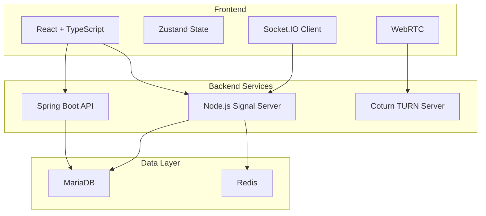

# Mystery Place - Voice Chat Platform 🎙️

**Discord-style Real-time Voice & Text Chat System**

---

## 🎯 **프로젝트 개요**

Mystery Place는 Discord 스타일의 실시간 음성/텍스트 채팅 시스템으로, 서버-채널 계층 구조와 커스텀 역할 시스템을 제공하는 확장 가능한 커뮤니티 플랫폼입니다.

### ✨ **주요 특징**
- 🏢 **서버-채널 구조**: Discord와 같은 계층적 커뮤니티 공간
- 🔐 **비밀번호 보호**: BCrypt 해싱으로 안전한 서버 접근 제어
- 👥 **커스텀 역할**: JSON 기반 세밀한 권한 관리 시스템
- 💬 **실시간 채팅**: WebSocket + Redis 버퍼링으로 고성능 메시징
- 🎤 **음성 채팅**: WebRTC P2P 음성 통신 (개발 예정)
- 📱 **Discord 스타일 UI**: 친숙하고 직관적인 사용자 경험

---

## 🏗️ **아키텍처**



### **서비스 구성**
- **프론트엔드**: React 18 + TypeScript + TailwindCSS
- **API 서버**: Spring Boot 3.x + JWT 인증
- **실시간 서버**: Node.js + Socket.IO + Redis 버퍼링
- **음성 서버**: Coturn TURN Server (WebRTC)
- **데이터베이스**: MariaDB 10.9 + Redis

---

## 🚀 **개발 현황**

### ✅ **완료된 기능 (95%)**

#### **1. 데이터베이스 설계**
- **서버-채널 계층 구조** (V1.4.1 마이그레이션)
- **커스텀 역할 시스템** (JSON 권한 배열)
- **서버별 사용자 프로필** (닉네임/아바타 오버라이드)
- **메시지 시스템** (서버-채널별 분리)

#### **2. 백엔드 API (Spring Boot)**
- **서버 관리**: CRUD, 입장/탈퇴, 멤버 추방
- **채널 관리**: CRUD, 타입별 채널 (텍스트/음성/혼합)
- **역할 관리**: 동적 역할 생성, 권한 할당
- **멤버 관리**: 서버별 프로필, 역할 배정
- **메시지 시스템**: 서버-채널별 메시지 CRUD, 검색, 통계
- **에러 처리**: 26개 Voice Chat 전용 에러 코드

#### **3. 메시지 시스템 (신규 완료)**
- **ChatMessageRepository**: 서버-채널별 20+ 쿼리 메소드
- **ChatMessageService**: 서버-채널 구조 완전 지원
- **ChatMessageController**: REST API 엔드포인트 구현
- **ChatMessageDto**: 서버-채널 정보 포함한 DTO 구조

#### **4. 실시간 인프라**
- **Redis 메시지 버퍼링**: 배치 처리로 DB 부하 최적화
- **Signal Server**: WebSocket 기반 실시간 통신
- **TURN Server**: WebRTC NAT 통과 지원
- **Docker 통합**: 모든 서비스 컨테이너화 완료

#### **5. 개발 환경**
- **Docker Compose**: 통합 개발 환경 구성
- **Makefile**: 빌드/배포 자동화
- **마이그레이션**: Flyway 기반 스키마 버전 관리

### 🚧 **진행 중 (5%)**
1. **시그널 서버 서버-채널 적용**
2. **React UI 컴포넌트**
3. **WebRTC 음성 채팅**

---

## 🗄️ **데이터베이스 스키마**

### **핵심 테이블 구조**
```sql
-- 서버 (커뮤니티 공간)
chat_servers: 비밀번호 보호, 최대 멤버 수 제한
├── server_members: 서버별 프로필, 역할 할당
├── server_roles: 커스텀 역할, JSON 권한 시스템
└── server_channels: 채널 (텍스트/음성/혼합)
    ├── channel_members: 채널별 멤버 관리
    └── chat_messages: 서버-채널별 메시지
```

### **권한 시스템 설계**
```json
{
  "permissions": [
    "canManageServer",
    "canManageChannels", 
    "canManageRoles",
    "canKickMembers",
    "canSendMessages",
    "canUseVoice"
  ]
}
```

---

## 📂 **프로젝트 구조**

```
/Users/byeonsanghun/goinfre/crime-cat/
├── 📁 backend/backend/src/main/java/com/crimecat/backend/
│   ├── 💬 chat/                    # Voice Chat 시스템
│   │   ├── domain/                 # 엔티티 (서버, 채널, 역할, 멤버)
│   │   ├── repository/             # JPA Repository
│   │   ├── service/                # 비즈니스 로직
│   │   ├── controller/             # REST API
│   │   └── dto/                    # 데이터 전송 객체
│   ├── 🔐 auth/                    # Discord OAuth2 인증
│   ├── 👤 user/                    # 사용자 관리
│   └── ⚙️ config/                  # Spring 설정
├── 📁 frontend/src/
│   ├── 🎨 components/chat/         # Voice Chat UI (예정)
│   ├── 📦 store/useAppStore.ts     # Zustand 상태 관리
│   ├── 🔌 api/                     # API 클라이언트
│   └── 🎯 hooks/                   # React 훅
├── 📁 docker/
│   ├── 🌐 signal-server/           # WebSocket 실시간 서버
│   ├── 🗄️ mariadb/db/migrations/   # 데이터베이스 마이그레이션
│   ├── 🚀 nginx/                   # 리버스 프록시
│   └── 📊 redis/                   # 캐싱 & 메시지 버퍼링
├── 📁 config/
│   ├── 🐳 dockercompose/           # Docker Compose 설정
│   ├── 🔧 .env                     # 환경 변수
│   └── 📜 Makefile                 # 빌드 스크립트
└── 📁 bot/                         # Discord 봇 (기존)
```

---

## 🛠️ **기술 스택**

### **프론트엔드**
- **React 18** + **TypeScript** + **Vite**
- **TailwindCSS** (Discord 스타일 디자인)
- **Zustand** (전역 상태 관리)
- **Socket.IO Client** (실시간 통신)
- **WebRTC API** (음성 채팅)

### **백엔드**
- **Java 17** + **Spring Boot 3.x**
- **Spring Security** + **JWT**
- **Spring Data JPA** + **Validation**
- **BCrypt** (비밀번호 해싱)
- **MariaDB 10.9**

### **실시간 서비스**
- **Node.js** + **Socket.IO**
- **Redis** (메시지 버퍼링)
- **Coturn** (TURN 서버)

### **인프라**
- **Docker** + **Docker Compose**
- **Nginx** (리버스 프록시)
- **Flyway** (마이그레이션)

---

## 🚀 **개발 시작하기**

### **1. 환경 설정**
```bash
# 저장소 클론
git clone [repository-url]
cd crime-cat

# 환경 변수 설정
cp config/.env.example config/.env
# .env 파일 편집 (Discord OAuth2, DB 설정 등)
```

### **2. Docker 개발 환경 실행**
```bash
# 전체 서비스 시작
make dev

# 또는 개별 실행
docker-compose -f config/dockercompose/docker-compose.dev.yaml up -d
```

### **3. 개발 서버 확인**
- **프론트엔드**: http://localhost:3000
- **백엔드 API**: http://localhost:8080
- **Signal Server**: http://localhost:4000
- **MariaDB**: localhost:3306
- **Redis**: localhost:6379

### **4. 데이터베이스 마이그레이션**
```bash
# 자동 실행 (Docker 시작 시)
# 수동 실행 시
make migrate
```

---

## 📡 **API 엔드포인트**

### **서버 관리**
```http
POST   /api/servers                 # 서버 생성
GET    /api/servers/{serverId}      # 서버 조회
GET    /api/servers/my              # 내 서버 목록
POST   /api/servers/{serverId}/join # 서버 입장
DELETE /api/servers/{serverId}      # 서버 삭제
```

### **채널 관리**
```http
POST   /api/servers/{serverId}/channels           # 채널 생성
GET    /api/servers/{serverId}/channels           # 채널 목록
GET    /api/servers/{serverId}/channels/{channelId} # 채널 조회
POST   /api/servers/{serverId}/channels/{channelId}/join # 채널 입장
```

### **역할 관리**
```http
POST   /api/servers/{serverId}/roles              # 역할 생성
GET    /api/servers/{serverId}/roles              # 역할 목록
PUT    /api/servers/{serverId}/roles/{roleId}     # 역할 수정
DELETE /api/servers/{serverId}/roles/{roleId}     # 역할 삭제
```

### **메시지 관리**
```http
POST   /api/servers/{serverId}/channels/{channelId}/messages         # 메시지 전송
GET    /api/servers/{serverId}/channels/{channelId}/messages         # 메시지 목록 조회
GET    /api/servers/{serverId}/channels/{channelId}/messages/recent  # 최근 메시지 조회
GET    /api/servers/{serverId}/channels/{channelId}/messages/since   # 특정 시간 이후 메시지
GET    /api/servers/{serverId}/channels/{channelId}/messages/search  # 메시지 검색
GET    /api/servers/{serverId}/channels/{channelId}/messages/users/{userId} # 사용자별 메시지
GET    /api/servers/{serverId}/channels/{channelId}/messages/count   # 메시지 수 통계
```

### **멤버 관리**
```http
GET    /api/servers/{serverId}/members            # 멤버 목록
POST   /api/servers/{serverId}/members/{userId}/roles # 역할 할당
GET    /api/servers/{serverId}/members/{userId}/permissions # 권한 조회
```

---

## 🔐 **인증 시스템**

### **Discord OAuth2 인증**
```javascript
// 로그인 플로우
Discord OAuth2 → JWT 토큰 발급 → API 인증 헤더
```

### **JWT 토큰 사용**
```http
Authorization: Bearer {jwt-token}
```

---

## 🎯 **성능 최적화**

### **Redis 메시지 버퍼링**
- **배치 처리**: 5초마다 또는 50개 메시지 단위
- **메모리 효율**: Redis List 구조 사용
- **장애 대응**: 실패 시 재시도 로직

### **데이터베이스 최적화**
- **복합 인덱스**: 서버-채널별 메시지 조회 최적화
- **소프트 삭제**: 데이터 무결성 유지
- **페이지네이션**: 무한 스크롤 지원

---

## 📊 **모니터링**

### **개발 도구**
```bash
# 로그 확인
docker-compose logs -f signal-server
docker-compose logs -f backend

# Redis 모니터링
redis-cli monitor

# 데이터베이스 상태
docker-compose exec db mysql -u root -p
```

### **헬스체크**
- **Signal Server**: http://localhost:4000/health
- **Backend**: http://localhost:8080/actuator/health

---

## 🔄 **배포**

### **개발 환경**
```bash
make dev-up     # 개발 서버 시작
make dev-down   # 개발 서버 종료
make logs       # 로그 확인
```

### **프로덕션 빌드**
```bash
make build      # 전체 빌드
make deploy     # 배포 (예정)
```

---

## 🤝 **기여하기**

### **개발 브랜치**
- **main**: 안정 버전
- **common/voice_chat**: Voice Chat 개발 브랜치

### **커밋 컨벤션**
```
feat: 새로운 기능 추가
fix: 버그 수정
docs: 문서 업데이트
refactor: 코드 리팩토링
test: 테스트 추가
```

---

## 📋 **개발 현황**

### **완료된 마일스톤**
- ✅ Phase 1: 데이터베이스 설계 및 마이그레이션
- ✅ Phase 2: Spring Boot REST API 구현
- ✅ Phase 3: 커스텀 역할 시스템
- ✅ Phase 4: Redis 메시지 버퍼링
- ✅ Phase 5: Docker 인프라 통합
- ✅ Phase 6: 메시지 시스템 완전 구현

### **현재 진행 중**
- 🚧 Phase 7: Signal Server 서버-채널 적용
- 🚧 Phase 8: React UI 컴포넌트 개발

### **다음 단계**
- 📝 Phase 9: WebRTC 음성 채팅 통합
- 📝 Phase 10: 모바일 최적화
- 📝 Phase 11: 성능 튜닝 및 배포

---

## 📞 **문의**

프로젝트에 대한 문의사항이나 기여 방법은 아래 문서를 참조하세요:

- **개발 현황**: [VOICE_CHAT_DEVELOPMENT_STATUS.md](./VOICE_CHAT_DEVELOPMENT_STATUS.md)
- **프로젝트 개요**: [PROJECT_OVERVIEW.md](./PROJECT_OVERVIEW.md)
- **기능 명세**: [voice_chat_feat.md](./voice_chat_feat.md)

---

**🎙️ Mystery Place Voice Chat - Discord-style Real-time Communication Platform**